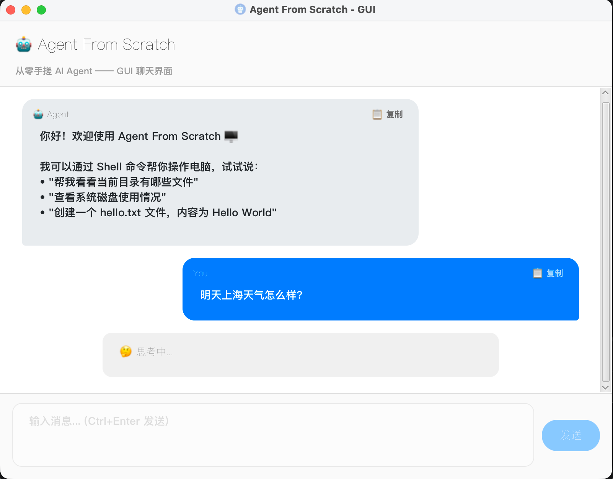
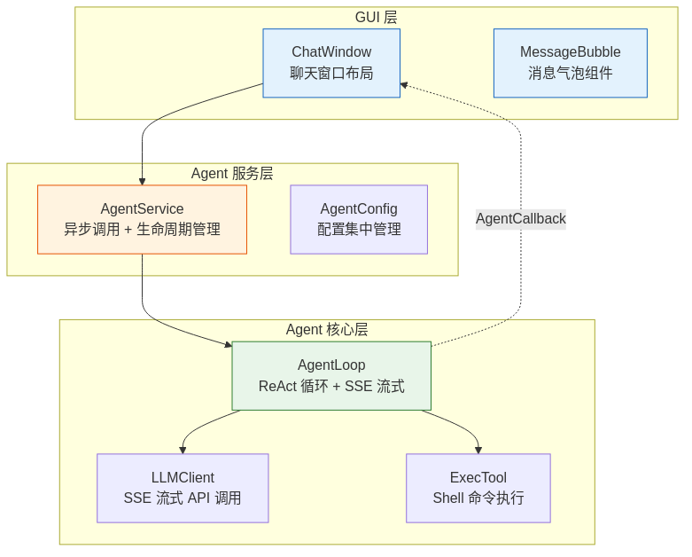

> 前几篇文章，我们的 Agent 一直活在终端里——黑底白字，`You >` 输入，`Agent >` 输出。能用，但不好看。
>
> 这篇文章做一件事：**给 Agent 装上图形界面。** 聊天气泡、流式打字效果、工具调用可视化——让它看起来像一个真正的桌面 AI 助手。

---

## 一、为什么要做 GUI

直接原因很朴素：**Java 的命令行交互太难搞了。**

demo01 用 `Scanner` 读取用户输入，一行一回车。但实际使用中你经常想输入多行内容——比如贴一段代码让 Agent 分析，或者写一段详细的任务描述。你想要的是 Ctrl+Enter 发送、Enter 只是换行，这在 Java 的标准 `System.in` 里几乎做不到（终端的行缓冲模式不允许你拦截单个按键）。

我调查了一圈，Java 里做终端快捷键的方案（JLine、Lanterna 之类）要么太重，要么兼容性堪忧，没有特别完美的选择。那为什么 Claude Code、Cursor 这些命令行 Agent 可以做到？人家用的是 Node.js + Ink（React 终端 UI），生态不一样，人家厉害呗 🤣

更深层的原因是**信息分层**。demo01 运行时，终端里混杂着 DEBUG 日志、HTTP 请求/响应、工具调用、用户确认——你得从一堆 JSON 里"挖"出有用信息。GUI 可以把不同类型的信息用不同样式的气泡区分开，思考过程用状态提示不干扰主对话流，流式输出逐字显示而不是等全部生成完才一次性刷出来。

既然终端满足不了需求，那就换个战场。

完成的界面大概长这样：



---

## 二、架构设计：三层分离

demo02 不是在 demo01 上硬塞一个界面，而是重新做了分层：



**关键设计决策：GUI 和 Agent 通过回调接口通信，互不依赖。**

`AgentCallback` 是这个设计的核心胶水：

```java
public interface AgentCallback {
    void onToolCall(String toolName, String argsJson);   // Agent 调用了工具
    void onToolResult(String toolName, String result);   // 工具返回了结果
    void onError(String errorMessage);                    // 出错了

    // SSE 流式回调
    default void onStreamStart() {}                       // 开始输出
    default void onStreamToken(String token) {}           // 收到一个 token
    default void onStreamComplete(String fullContent) {}  // 输出完成
}
```

AgentLoop 在执行过程中通过回调通知 GUI，GUI 在 JavaFX Application Thread 上更新界面。**Agent 不知道自己有没有界面，GUI 不知道 Agent 怎么工作。**

---

## 三、SSE 流式输出：逐字打字效果

demo00/01 用的是非流式调用——发一个请求，等 LLM 生成完所有内容，一次性返回。用户看到的效果是"等了几秒，突然蹦出一大段文字"。

demo02 改用了 **SSE（Server-Sent Events）流式调用**：LLM 每生成一个 token 就推送一次，GUI 实时追加显示。效果就像 ChatGPT 样一个字一个字"打"出来。

### 流式请求

和非流式的唯一区别是加了 `"stream": true`：

```java
requestBody.put("stream", true);
```

### 流式响应解析

SSE 响应是一行一行的 `data:` 事件：

```
data: {"choices":[{"delta":{"content":"你"}}]}
data: {"choices":[{"delta":{"content":"好"}}]}
data: {"choices":[{"delta":{"content":"！"}}]}
data: [DONE]
```

但 tool_calls 比较特殊——参数是**分片传递**的：

```
data: {"choices":[{"delta":{"tool_calls":[{"index":0,"id":"call_xxx","function":{"name":"exec","arguments":""}}]}}]}
data: {"choices":[{"delta":{"tool_calls":[{"index":0,"function":{"arguments":"{\"co"}}]}}]}
data: {"choices":[{"delta":{"tool_calls":[{"index":0,"function":{"arguments":"mmand\""}}]}}]}
data: {"choices":[{"delta":{"tool_calls":[{"index":0,"function":{"arguments":": \"ls"}}]}}]}
```

所以需要一个 `ToolCallAccumulator` 来逐步拼接：

```java
private static class ToolCallAccumulator {
    String id;
    String name;
    final StringBuilder arguments = new StringBuilder();  // 逐片追加
}
```

文本 token 直接通过 `onToken` 回调推送给 GUI；tool_calls 的 arguments 则在流结束后一次性组装成完整的 `ChatMessage`。

---

## 四、消息气泡：六种类型，一套组件

`MessageBubble` 是一个自定义的 JavaFX `HBox` 组件，支持六种消息类型：

| 类型 | 外观 | 用途 |
|---|---|---|
| `USER` | 蓝色背景，右对齐 | 用户输入 |
| `AGENT` | 灰色背景，左对齐 | Agent 回复 |
| `TOOL_CALL` | 黄色边框，等宽字体 | 工具调用（显示命令） |
| `TOOL_RESULT` | 绿色边框，等宽字体 | 工具执行结果 |
| `ERROR` | 红色边框 | 错误信息 |
| `STATUS` | 灰色居中，斜体 | 状态提示（"🤔 思考中..."） |

每个气泡用只读 `TextArea` 渲染内容（支持文字选择复制），右上角有一个"📋 复制"按钮。

### 流式更新

流式输出时，GUI 先创建一个空的 `AGENT` 气泡，然后逐 token 追加：

```java
// onStreamStart: 创建空气泡
streamingBubble = new MessageBubble(MessageBubble.Type.AGENT, "");
messageContainer.getChildren().add(streamingBubble);

// onStreamToken: 逐字追加
streamingBubble.appendContent(token);

// onStreamComplete: 最终定稿
streamingBubble.finalizeContent(fullContent);
```

气泡高度根据内容行数自适应，最大 300px，超出可滚动。

---

## 五、异步通信：不能卡 UI

JavaFX 有一条铁律：**所有 UI 操作必须在 Application Thread 上执行。** 但 Agent 的 LLM 调用可能要好几秒甚至十几秒——如果在 UI 线程里等，窗口会直接卡死。

`AgentService` 用一个单线程 Executor 解决这个问题：

```java
private final ExecutorService executor = Executors.newSingleThreadExecutor(r -> {
    Thread t = new Thread(r, "agent-worker");
    t.setDaemon(true);  // 守护线程，窗口关闭时自动退出
    return t;
});

public void sendMessage(String message, Consumer<String> onSuccess, Consumer<String> onError) {
    executor.submit(() -> {
        String response = agentLoop.run(message);  // 在后台线程执行
        onSuccess.accept(response);                  // 回调通知
    });
}
```

而所有回调里的 UI 更新都用 `Platform.runLater()` 切回 UI 线程：

```java
@Override
public void onToolCall(String toolName, String argsJson) {
    Platform.runLater(() ->                          // 切到 UI 线程
        addMessage(MessageBubble.Type.TOOL_CALL, toolName + "(" + argsJson + ")")
    );
}
```

**后台线程跑 Agent，UI 线程刷界面，回调是桥梁。**

---

## 六、从终端到桌面：变了什么，没变什么

| | demo01（终端） | demo02（GUI） |
|---|---|---|
| 交互方式 | `Scanner` + `System.out` | JavaFX 窗口 |
| LLM 调用 | 非流式（等全部生成完） | SSE 流式（逐 token 推送） |
| 工具执行确认 | 终端 y/N 输入 | 自动执行（危险命令仍拦截） |
| 信息展示 | 所有信息混在终端日志里 | 分类型气泡，颜色区分 |
| 线程模型 | 单线程阻塞 | 后台线程 + UI 线程 |
| **Agent 核心逻辑** | **完全一样** | **完全一样** |

最后一行是重点：**ReAct 循环、工具注册、消息模型、System Prompt——全都没变。** 变的只是"皮肤"和"通信方式"。

这也验证了分层设计的价值：Agent 核心是一个纯逻辑层，不关心输入从哪来、输出到哪去。终端也好，GUI 也好，Web API 也好——套一层适配器就行。

---

## 后续

给 Agent 装上 GUI 后，一个自然的问题出现了：**每次关掉窗口，对话就没了。** Agent 没有记忆，不记得上一次聊了什么。下一步会探索会话持久化和记忆系统。

---

*系列文章：*
- [Claude Code 泄露 51 万行源码，我用 Java 手搓了同款 Agent](/writing/build-ai-agent-from-scratch)
- [一个工具打天下：给 AI Agent 装上 Shell，它就能操作你的电脑](/writing/one-tool-to-rule-ai-agent-shell)
- 本文：从命令行到桌面应用：给手搓 Agent 做一个 GUI
-下一篇：关掉窗口对话就没了？给 Agent 加上会话管理

*本文源码：[agent-from-scratch](https://github.com/JingkaiTang/agent-from-scratch)*