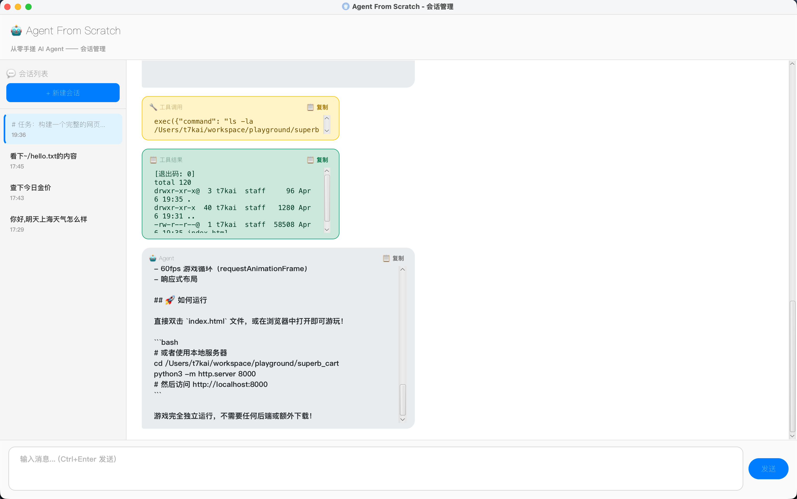

> 上篇做完 GUI 后，我兴冲冲地和 Agent 聊了半小时。然后手滑关了窗口。
>
> 再打开，空空如也。



---

## 一、需要解决什么

demo02 的对话历史只存在内存里——`AgentLoop` 的 `conversationHistory` 是一个 `ArrayList`，进程一退出就没了。而且只有一个对话，想聊新话题只能重启。

demo03 要做两件事：

1. **多会话** — 左侧侧边栏列出所有对话，点击切换，右键删除，随时新建
2. **持久化** — 对话记录存到磁盘，下次打开自动恢复

---

## 二、会话数据模型

一个 `Session` 就是一组对话消息加元数据：

```java
public class Session {
    private String id;                    // UUID
    private String title;                 // 会话标题
    private LocalDateTime createdAt;      // 创建时间
    private LocalDateTime updatedAt;      // 最后更新时间
    private List<ChatMessage> messages;   // 对话消息列表
}
```

几个设计细节：

- **标题自动生成** — 首条用户消息到达时，取前 20 个字符作为标题。你说"帮我查一下上海的天气"，标题就是"帮我查一下上海的天气"。不需要手动命名。
- **updatedAt 自动刷新** — 每次追加消息都更新，侧边栏按这个字段倒序排列，最近聊的永远在最上面。
- **支持 Jackson 序列化** — 加了 `@JsonProperty` 注解，可以直接序列化成 JSON 文件。

---

## 三、持久化：每个会话一个 JSON 文件

`SessionStore` 负责存储，策略极简——**每个会话一个 JSON 文件，存在 `~/.afs/sessions/` 目录下**：

```
~/.afs/sessions/
├── a1b2c3d4-e5f6-7890-abcd-ef1234567890.json
├── f9e8d7c6-b5a4-3210-fedc-ba0987654321.json
└── ...
```

为什么不用数据库？因为没必要。会话数据的访问模式非常简单——按 ID 读写整个会话，不需要复杂查询。JSON 文件可读、可调试、可手动编辑，完美契合"手搓学习"的定位。

一个会话文件长这样：

```json
{
  "id": "a1b2c3d4-...",
  "title": "帮我看看当前目录有哪些文件",
  "createdAt": "2026-04-06T15:00:00",
  "updatedAt": "2026-04-06T15:05:30",
  "messages": [
    { "role": "system", "content": "你是一个能操作电脑的 AI 助手..." },
    { "role": "user", "content": "帮我看看当前目录有哪些文件" },
    { "role": "assistant", "toolCalls": [...] },
    { "role": "tool", "content": "file1.txt\nfile2.java\n...", "toolCallId": "call_xxx" },
    { "role": "assistant", "content": "当前目录下有以下文件：..." }
  ]
}
```

**完整的对话历史——包括 system prompt、用户消息、assistant 回复、工具调用、工具结果——全都存下来了。** 恢复时直接把 messages 列表喂回 AgentLoop，Agent 就像从没离开过一样。

容错也很简单：加载时某个 JSON 文件损坏就跳过，不影响其他会话。

---

## 四、会话管理：SessionManager

`SessionManager` 维护内存中的会话列表和当前活跃会话：

```java
public class SessionManager {
    private final Map<String, Session> sessions = new LinkedHashMap<>();
    private String activeSessionId;
    private final SessionStore store;
    private final List<SessionChangeListener> listeners = new CopyOnWriteArrayList<>();
}
```

核心操作：

| 操作 | 做了什么 | 边界处理 |
|---|---|---|
| `createSession()` | 新建空白会话 + 自动切换 + 通知 GUI | — |
| `switchSession(id)` | 切换活跃会话 + 通知 GUI | 已是当前会话则跳过 |
| `deleteSession(id)` | 删除 + 自动切换到最近会话 + 通知 GUI | 删光了就自动新建一个 |
| `appendMessage(msg)` | 追加到当前会话 + 持久化 + 标题变化时通知 GUI | — |

**观察者模式通知 GUI**——通过 `SessionChangeListener` 接口，会话列表或活跃会话变化时通知界面刷新：

```java
public interface SessionChangeListener {
    void onSessionListChanged();              // 列表变了（新增/删除/排序）
    void onActiveSessionChanged(Session s);   // 当前会话切了
}
```

---

## 五、最棘手的问题：会话切换时的上下文同步

会话管理本身不难，难的是**如何让 AgentLoop 的对话上下文和 SessionManager 保持同步**。

想象一下：你在会话 A 里聊了 10 条消息，然后切到会话 B。AgentLoop 的 `conversationHistory` 里装的还是会话 A 的消息——如果直接发消息，Agent 会以为自己还在聊会话 A 的话题。

解决方案：给 AgentLoop 新增两个方法：

```java
// 替换对话历史（切换到有历史的会话时）
void setConversationHistory(List<ChatMessage> history);

// 重置对话历史（切换到空白新会话时）
void resetConversation();
```

由 `AgentService` 作为桥梁协调两者——**SessionManager 不直接操作 AgentLoop**，所有协调逻辑都在 AgentService 里：


切换会话时的完整流程：

1. `SessionManager.switchSession(id)` — 切换活跃会话
2. `AgentService` 拿到目标会话的 messages
3. `AgentLoop.setConversationHistory(messages)` — 替换上下文
4. GUI 清空聊天区域，重新渲染目标会话的历史消息

发送消息时的同步流程：

1. 用户消息先通过 `SessionManager.appendMessage()` 追加到会话（持久化）
2. `AgentLoop.run()` 执行任务，内部产生 assistant/tool 等新消息
3. 执行完成后，`AgentService.syncNewMessagesToSession()` 把新消息同步回会话

---

好了，其实会话管理的本质，就是把 AgentLoop 内存里的 `ArrayList<ChatMessage>` 搬到磁盘上。

---

## 本文代码

https://github.com/JingkaiTang/agent-from-scratch

<!-- draft publish trigger -->
