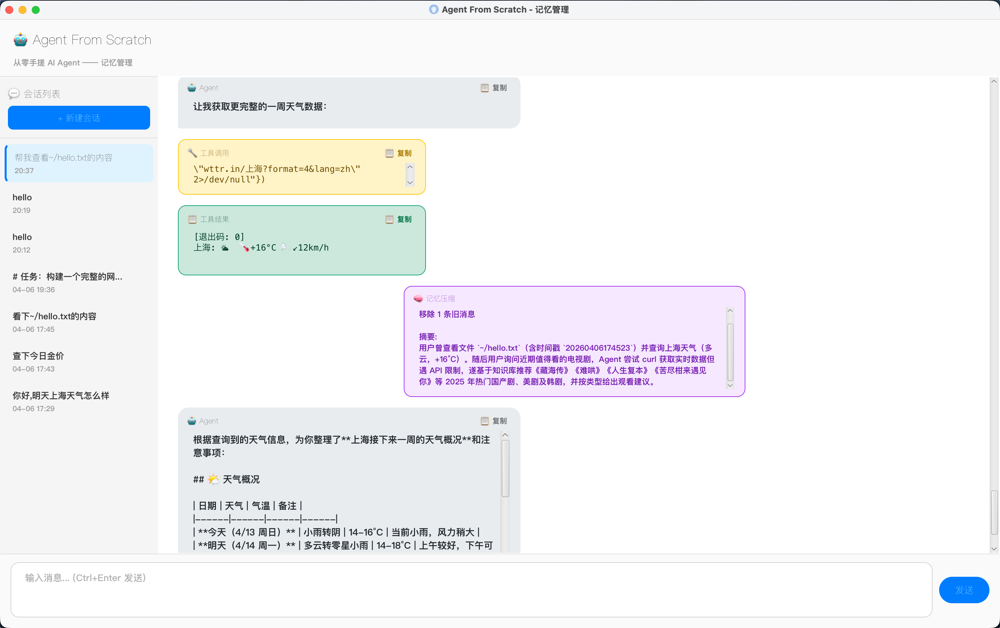

> 上一篇我们给 Agent 加上了会话管理，对话终于能存下来了。但新问题来了——**聊得越多越慢，直到 API 报错：上下文长度超限。** 人类健忘是缺点，Agent 什么都记着反而是灾难。


---

## 一、问题

demo03 的对话历史只增不减。每次调 LLM，整个 `ArrayList<ChatMessage>` 都要发过去。聊三五十轮没事，两三百轮就爆了（前提是你真的这么健谈🤣）。

更要命的是，大部分 token 花在了**没用的旧对话**上——半小时前查的天气、删的文件，占着上下文窗口，挤压真正有用的内容。

**核心矛盾：对话越长，有用信息密度越低，但成本和延迟越高。**

---

## 二、策略：滑动窗口 + LLM 摘要

旧对话用 LLM 压缩成一段摘要，只保留最近几轮完整对话。说白了就是开会时的"会议纪要"——你不需要逐字回放三小时的录音，一页纪要就够了。

```
压缩前: [System Prompt] + [30 轮完整对话]          → ~8000 tokens
压缩后: [System Prompt] + [摘要 ~200 字] + [最近 3 轮] → ~2000 tokens
```

**省 75%，最近对话完全保真。**

---

## 三、触发时机

在 `AgentLoop.run()` 的 ReAct 循环里，**每次调 LLM 之前**检查 token 用量：

```java
for (int step = 1; step <= maxSteps; step++) {
    // ⭐ 记忆管理：超阈值就压缩
    if (memoryManager != null) {
        CompactionResult result = memoryManager.checkAndCompact(conversationHistory);
        if (result != null) {
            conversationHistory = new ArrayList<>(result.getCompactedHistory());
            callback.onMemoryCompaction(result.getSummary(), 
                result.getTokensBefore(), result.getTokensAfter(), 
                result.getRemovedMessageCount());
        }
    }
    
    // 调 LLM（上下文已在安全范围内）
    ChatMessage assistantMsg = llmClient.chatStream(conversationHistory, toolsSchema, onToken);
    // ...
}
```

阈值通过 `~/.afs/config.json` 配置：

```json
{
  "memory": {
    "maxContextTokens": 8000,
    "compactionThreshold": 0.8,
    "keepRecentRounds": 3
  }
}
```

为了能够快速触发压缩，我们配置得小一些，当前 token 数超过 `8000 × 0.8 = 6400` 就触发压缩。

但实际上应该按照模型实际能力做配置，我们这边是demo教学，简化处理了。

---

## 四、压缩流程



几个细节：

- **"轮"的定义**：从一条 user 消息到下一条 user 消息之前的所有消息。一轮可能包含 user → assistant(tool_calls) → tool(result) → assistant(reply)，不能拆散。
- **摘要注入**：压缩后的摘要作为 `system` 消息插入，前缀 `[以下是之前对话的摘要]`，Agent 知道这是历史总结而非新指令。
- **摘要质量**：prompt 约束保留关键事实（路径、数字）、用户偏好、重要决策，200 字以内。

---

## 五、Token 估算

估算 token 量，一般使用 tiktoken，简化起见这次我们不用现成的框架，手搓了一个简易版：

```java
// 中文字符 → ~1.5 token/字
// 英文/数字/符号 → ~0.5 token/字
// 每条消息固定开销 → 4 token
```

精度约 ±20%，对于判断"该不该触发压缩"足够了。差 20% 无非早压一步晚压一步，又不是算工资，差不多得了。

---

## 六、GUI：紫色记忆气泡

压缩发生时，对话流中插入一个**紫色 🧠 气泡**：



```
上下文压缩: 6500 → 2100 tokens (节省 67%)
移除 35 条旧消息

摘要:
用户曾询问当前目录下的文件列表，Agent 通过 exec 工具执行了 ls -la 命令...
```

实际运行日志：

```
17:42:31 INFO  MemoryManager - Token 检查: 当前 6523 / 阈值 6400
17:42:31 INFO  MemoryManager - 超过阈值，触发上下文压缩
17:42:31 INFO  ConversationCompactor - 开始压缩: 47 条消息, 旧消息 35 条, 保留最近 12 条
17:42:33 INFO  ConversationCompactor - 压缩完成: 6523 → 2134 tokens (节省 67%), 移除 35 条
```

47 条消息压到 System Prompt + 摘要 + 最近 3 轮，Agent 继续聊，完全无感。就像你删掉了微信聊天记录但还记得对方欠你钱一样——关键信息不会丢。

---

短期记忆 = 滑动窗口 + LLM 摘要。旧对话压成摘要保留要点，最近几轮完整保留保证连贯。**记性好不如烂笔头，Agent 的烂笔头就是 LLM 帮它写的摘要。**

---
