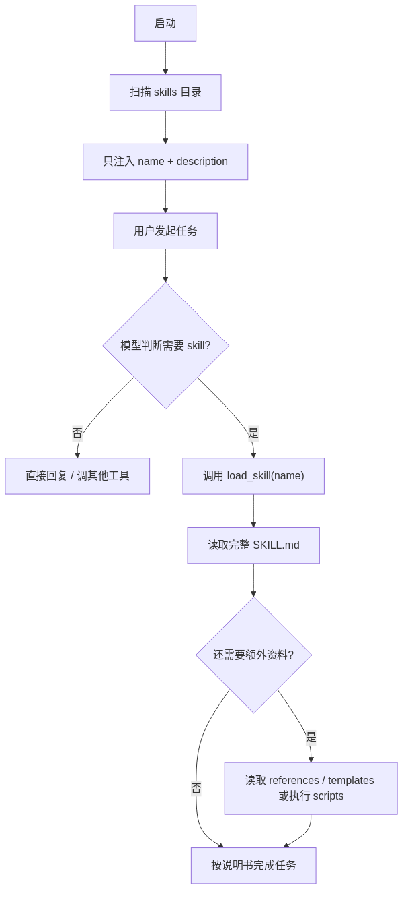
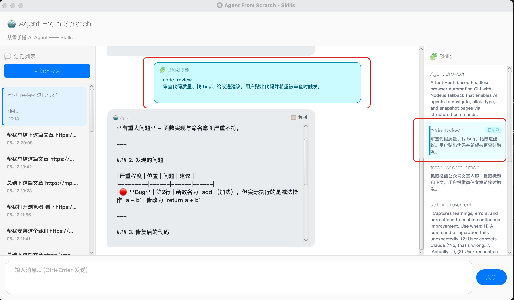
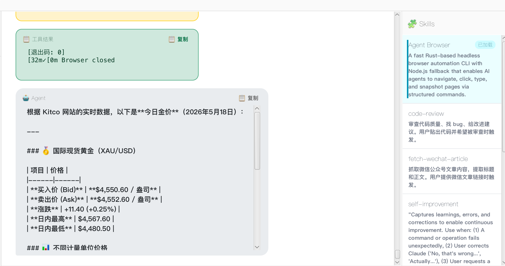
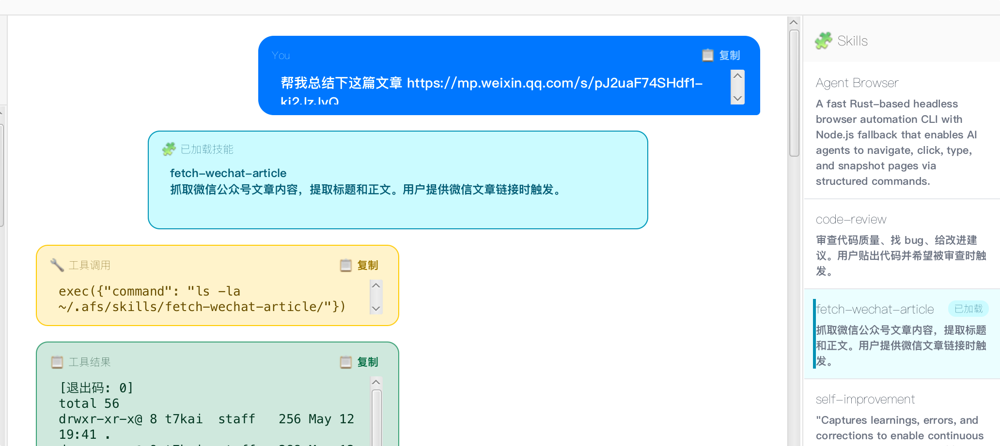

> 上一篇我们给 Agent 装上了长期记忆，解决的是「换个会话别装不认识」。但长期记忆解决的是「记得什么」，不是「怎么做事」。到了 demo06，我们要给它补上另一块能力：Skills。

Skill，本质上就是一份可以被 Agent 按需加载的任务说明书。

它用自然语言写清楚：什么场景触发、按什么步骤做、用什么输出格式、哪些坑要避开。

把可复用的工作流程沉淀成一个个独立能力包。

不是每次都写进 prompt，也不是靠用户临场补充。

而是让 Agent 在遇到固定任务时，自己拿对应说明书。

这一篇直接给我们的手搓 Agent 加一个最小可用的 Skills 机制。

---

## 一、一个 Skill 通常长什么样

一个 Skill 通常不是单个 prompt，而是一个目录。

目录里必须有一个入口文件：`SKILL.md`。

更完整的 Skill，还可以带脚本、模板、参考资料。

大概长这样：

```text
my-skill/
├── SKILL.md
├── scripts/
│   └── helper.py
├── references/
│   └── api.md
└── templates/
    └── output.md
```

其中只有 `SKILL.md` 是必需的。

其他都是可选的。

`SKILL.md` 通常分两部分。

第一部分是 frontmatter，也就是元数据。

告诉 Agent：这个 skill 叫什么，什么时候该用。

第二部分是正文。

告诉 Agent：用了以后具体该怎么做。

比如一个 code-review skill 可以长这样：

```markdown
---
name: code-review
description: 审查代码质量、找 bug、给改进建议。用户贴出代码并希望被审查时触发。
---

# Code Review Skill

当用户分享代码并希望你做 code review 时，按以下结构回复：

1. 总体评价
2. 发现的问题：位置 / 问题 / 建议
3. 改进建议
4. 亮点

注意：不要为了显得专业而硬挑无关紧要的格式问题。
```

这里最关键的是 `description`。

它不是写给人类看的简介。

它是写给模型看的触发条件。

模型会根据这句话判断：当前任务要不要加载这个 skill。

正文则是完整说明书。

可以写输出结构，可以写判断标准，可以写风格要求，也可以写反例。

那 `scripts/`、`references/`、`templates/` 这些目录是干嘛的？

它们是更复杂 Skill 的扩展能力。

比如：

- `scripts/` 放可执行脚本，处理一些确定性更强的任务。
- `references/` 放长文档、API 说明、规范材料。
- `templates/` 放输出模板、配置模板、示例文件。

比如 PDF 处理类 Skill，`SKILL.md` 可以告诉 Agent 什么时候处理 PDF，具体解析表单的逻辑则放到 `scripts/extract_forms.py`。

这样 Agent 不需要把脚本内容全部读进上下文。

它只需要在需要时执行脚本，拿结果即可。

这就是 Skill 和普通 prompt 最大的区别。

它不是一段孤零零的提示词。

它可以是一整个能力包。

---

## 二、demo06 里怎么支持 Skills

不过 demo06 是教学 demo。

我们不一口气做完整的能力包。

先跑通最小闭环。

也就是：

```text
一个 skill 目录 + 一个 SKILL.md
```

我们约定每个 skill 放在：

```text
~/.afs/skills/<name>/SKILL.md
```

首次启动时，如果 `~/.afs/skills/` 不存在，程序会自动从 resources 里拷贝三个内置示例：

- `code-review`：代码审查
- `translate-zh-en`：中英互译
- `summarize-long-text`：长文总结

然后启动时扫描这个目录。

只解析每个 `SKILL.md` 的 frontmatter：

- `name`
- `description`

正文不提前读。

正文等真正需要时再读。

代码上新增了一个 `skill` 包：

```text
demo06-skill-support/src/main/java/com/github/agent/demo06/skill/
├── SkillMeta.java
├── SkillLoader.java
├── SkillRegistry.java
└── LoadSkillTool.java
```

`SkillMeta` 保存元数据：`name`、`description`、`filePath`。

`SkillLoader` 扫描 `~/.afs/skills/`，解析每个 `SKILL.md`。

`SkillRegistry` 缓存这些元数据，并生成要塞进 system prompt 的 skill 菜单。

`LoadSkillTool` 提供一个工具：

```text
load_skill(name)
```

当模型判断当前任务需要某个 skill，就调用它。

它再从磁盘读取完整的 `SKILL.md`，返回给模型。

这就是 demo06 的核心链路。

那脚本型 Skill 能不能支持？

理论上可以。

因为我们的 Agent 本来就有 `exec` 工具。

如果后面把 skill 目录下的 `scripts/` 也纳入约定，让 `SKILL.md` 引导模型执行：

```text
~/.afs/skills/pdf-helper/scripts/extract_forms.py
```

它就能变成更完整的 Skill。

---

## 三、核心设计：渐进式披露

Skill 的核心设计理念是：

**渐进式披露。**

不要一上来把所有信息都塞给模型。

先给它看目录。

等它需要时，再给正文。

如果正文还不够，再让它去读引用文件，甚至执行脚本。

大概是三层：

```text
第一层：元数据
name + description，启动时加载，让模型知道有哪些 skill。

第二层：SKILL.md 正文
模型判断相关时加载，提供具体任务说明。

第三层：supporting files
references / templates / scripts，需要时才读取或执行。
```

在 demo06 里，我们实现了前两层。

第一层，启动时扫描所有 Skill，只把 `name + description` 注入 system prompt。

第二层，模型判断相关时，调用 `load_skill(name)` 加载完整 `SKILL.md`。

第三层，也就是脚本、模板、参考资料，理论上模型可以根据 `SKILL.md` 再去读取或执行。

为什么要这么麻烦？

主要就是为了节约模型的上下文资源。

试想一下，如果把所有 Skill 全塞进 system prompt：

三个 Skill 还能忍。

三十个 Skill 呢？

一百个 Skill 呢？

所以正确方式是这样：



真正好的 Skill，不是把所有东西一次性糊给模型。

而是像一本组织良好的手册。

先给目录。

再给章节。

最后才给附录。

这就是渐进式披露。

---

## 四、跑起来是什么效果

比如发一句：

```text
帮我 review 这段代码：

def add(a, b):
    return a - b
```

模型先在 system prompt 里看到 Skill 菜单。

它发现这个任务符合 `code-review` 的 description。

于是调用：

```json
{"name": "code-review"}
```

`LoadSkillTool` 读取：

```text
~/.afs/skills/code-review/SKILL.md
```

然后把完整正文返回给模型。

界面中间会出现一个「已加载技能」气泡。

右侧 `code-review` 这一项也会变成已加载状态。

接下来模型再输出 review 结果，就会按 `SKILL.md` 里的结构来。



这一刻，Skill 的价值就出来了。

它不是让模型突然拥有了审查代码的神秘能力。

模型本来就会审查代码。

Skill 让它用你规定的方式审查代码。

这就像你终于不是每次都在临场口述需求，而是把一套工作 SOP 沉淀下来了。

---

## 五、试试带脚本的复杂 Skill

demo06 没有专门实现 supporting files。

但前面说了，理论上它有扩展空间。

因为我们的 Agent 已经有 `exec`。

只要 Skill 正文里把脚本路径和执行方式说清楚，Agent 就有机会自己调用脚本。

为了验证这个猜想，我安装了一个无头浏览器 Skill：Agent Browser。

然后让它帮我查今日金价。



结果也成功了。

这说明一个很有意思的点：

我们没有专门做「脚本型 Skill 框架」。

但只要底层 Agent 已经具备文件访问和命令执行能力，Skill 就可以把这些能力组织起来。

换句话说，Skill 不一定要自己变成工具。

它可以告诉 Agent：什么时候该用哪个工具，怎么用。

---

## 六、能不能让 Agent 自己总结一个 Skill

再试一个更有意思的。

既然 Skill 本质上是一份说明书，那 Agent 能不能自己总结一个 Skill？

我先让它从微信公众号上抓取一篇文章，再总结给我。

完成得不错。

然后我继续让它把这个流程沉淀成一个 Skill。

结果还真成功了。

重启后再测一下。



可以成功触发。

这一步其实挺关键。

因为它说明 Skill 不只是「人给 Agent 写规则」。

也可以是 Agent 把一次成功的工作流反过来沉淀成规则。

这就有点像肌肉记忆了。

做过一次。

总结下来。

下次直接复用。

---

## 七、总结

这篇 demo06，本质上就是给 Agent 加了一套按需加载的任务说明书机制。

启动时只看 `name + description`，需要时再加载完整 `SKILL.md`。

这就是 Skills 的核心：渐进式披露。

我们的 demo06 只实现了前两层，但已经跑通了最关键的链路：

```text
发现 skill → 判断相关 → load_skill → 读取 SKILL.md → 按说明书执行
```

Tool 让 Agent 有手，Memory 让 Agent 有小本本，Skill 则让 Agent 有 SOP。

到了这一步，它终于不只是「能干活」了。

它开始知道：遇到某类任务，应该按哪套规矩干。

---

*本文源码：[agent-from-scratch](https://github.com/JingkaiTang/agent-from-scratch)*
