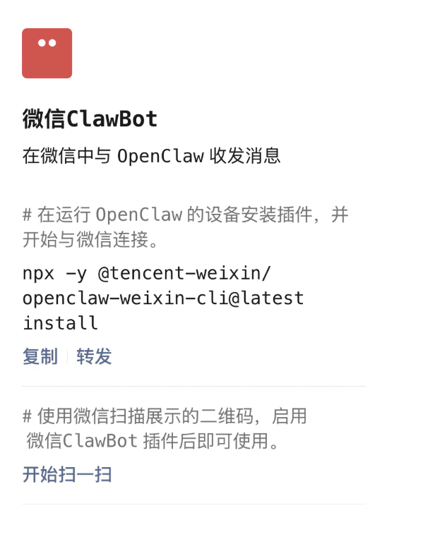
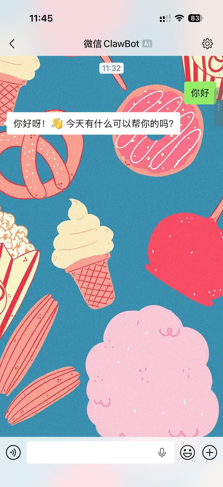

> **结论先行：** 当小龙虾成为 AI 办公赛道的关键胜负手，飞书凭借深度原生整合率先落子，吃尽早期市场红利。今天（3 月 22 日）微信紧急上线 ClawBot 插件，一级入口直接打通 OpenClaw，棋局中盘终于落子。

---

## 🎯 微信的一级入口

今天（3 月 22 日）上午微信紧急上线了**ClawBot 微信插件**，可以直接在 OpenClaw 里添加插件连接微信。

**关键点：** 这一次是微信的**一级入口**，不是之前的小程序或者微信客服。

微信目前的口径是插件还在灰度中，如果命中灰度，可以在 **我的 → 设置 → 功能栏目** 中找到插件选项，里面就有 ClawBot 的插件：



## 🔧 连接步骤

1. **安装微信插件**
   ```bash
   npx -y @tencent-weixin/openclaw-weixin-cli@latest install
   ```

2. **扫码绑定**
   - 插件会自动展示二维码
   - 微信扫码绑定即可

3. **开始对话**
   - 可直接跟你的主 Agent 对话



## ⚠️ 玄学复现条件

实际尝试了一下，复现条件有点玄学：

1. 首先你要安装微信版本 **8.0.70**（截止到发文前，iOS 已经更新，安卓还是 8.0.69）
2. 刚更新进到微信插件里是**没有**ClawBot 插件的
3. 然后在小龙虾里安装对应插件
4. 安装完，直接微信扫码，这个时候大概率会让你更新
5. 然后再去微信的插件里，会发现已经有了 ClawBot 插件
6. 这个时候扫码就能连上了

目前还只能对话一个 Agent，期待能够支持更多个机器人或者像 Telegram 一样支持多 Topic 对话。

## 🐟 小龙虾这条鲶鱼

不得不服小龙虾这条鲶鱼的威力。

之前在国内连接小龙虾，飞书几乎是唯一选择，各种最佳实践的文章层出不穷。

直到前两周，腾讯系开启了密集的战略补位：
- 先是接连推出 **WorkBuddy**、**QClaw** 等多款场景化 AI 工具
- 又高调成为了 OpenClaw 的主要赞助商
- 再到如今微信 ClawBot 插件正式打通 OpenClaw，更是生态层面的重磅落子

**WorkBuddy** 我也一直在使用，1-2 天更新一次，超高迭代频率。从刚开始 UI 都是 bug，到现在各种 skill 以及预设 Agent 的完善，可以看到腾讯是下定了打赢 AI 办公战役的决心的。

---

**棋局已入中盘，好戏刚刚开始。**
