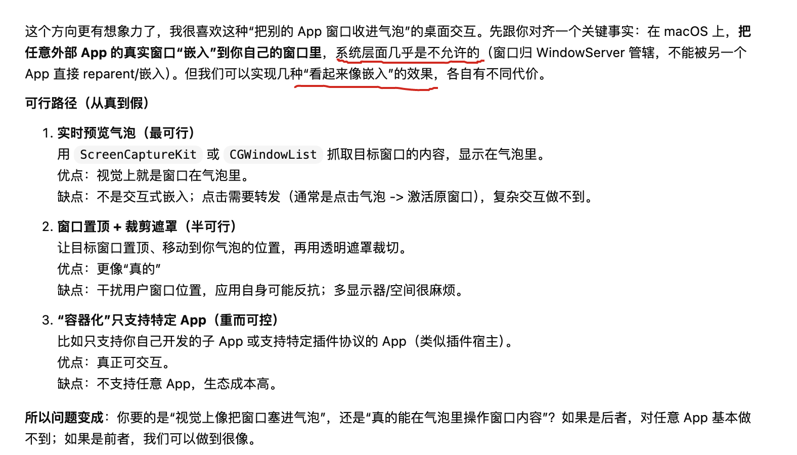

> 我想做一个把任意 App 塞进菜单栏气泡的工具。AI 说：真的做不到，但我们可以假装。于是 BarPin 诞生了。

---

## 起因：Cmd+Tab 按烦了

macOS 用户应该都有这个体验——开着七八个 App，Cmd+Tab 按出来一长串图标，眼花缭乱地找半天，才切到想要的那个。

我每天的工作流大概是这样的：写代码 → 切到终端跑一下 → 切到浏览器查文档 → 切到 Obsidian 记个笔记 → 切回 IDE……来来回回，光是"切换"这个动作就消耗了大量注意力。

有一款叫 [MenubarX](https://menubarx.app/) 的 App 给了我灵感——它可以把网页嵌入到菜单栏的气泡里，点一下就弹出来，再点一下就收回去。非常优雅。

我就想：**如果不止网页，而是任意 App 都能这样呢？**

于是我打开 Codex（OpenAI 的 AI 编程助手），跟它描述了我的想法。

---

## AI 的第一课：学会妥协

我兴致勃勃地告诉 Codex："我要做一个能把任意 App 的窗口真正嵌入到气泡容器里的工具。"

Codex 很认真地给我分析了三条路线：

简单翻译一下它的结论：

- **方案一**（实时预览）：截取窗口画面显示在气泡里——看着像，但点不了
- **方案二**（窗口置顶+遮罩裁切）：真的移动窗口过来——半可行，但会打架
- **方案三**（容器化）：只支持自己开发的子 App——生态成本太高

最后 Codex 灵魂一问：

> 你要的是"视觉上像把窗口塞进气泡"，还是"真的能在气泡里操作窗口内容"？如果是前者，**我们可以做到很像。**

我欣然接受了这个设定。

**这其实是 Vibe Coding 最有意思的地方：你提出一个模糊的想法，AI 帮你厘清边界，然后在可行的范围内给你最好的方案。** 比起闷头写代码写到一半发现技术路线不通，这种"先聊再做"的方式高效得多。

---

## 10 秒看懂 BarPin

先上效果，比我啰嗦半天管用：

**一句话：点菜单栏图标，App 就弹出来贴在图标下方；再点一下，就收回去。就像原生的菜单栏工具一样。**

---

## 它到底能干什么

### 🎯 任意 App 变气泡

不需要 App 本身做任何适配。BarPin 通过 macOS 的 Accessibility API 直接控制外部窗口的位置和大小——你电脑上装的任何 App 都可以被"Pin"到菜单栏。

### 🔄 智能三态切换

点击菜单栏图标时，BarPin 会自动判断当前状态：

| App 状态 | 点击后的行为 |
|---|---|
| 在前台（正在用） | 隐藏窗口 |
| 在后台（被遮住了） | 唤到最前 |
| 没有可见窗口 | 重新拉起并定位 |

**一个点击，覆盖所有情况。** 不用管 App 现在在哪、是什么状态，点就完了。

### 📌 窗口贴近菜单栏

BarPin 不是随便弹一个窗口出来——它会精确计算菜单栏图标的位置，把 App 窗口定位在正下方。视觉上就像真的从菜单栏"弹"出来的，有归属感。

### 📐 窗口大小记忆

每个被 Pin 的 App 独立记住你调整过的窗口尺寸。下次唤起时自动恢复，不用每次都手动拖。

### ⌨️ 全局热键

每个 Pin 可以绑定独立的快捷键，而且自带冲突检测。摸鱼的时候，老板走过来，一个快捷键收掉，走了再一个快捷键弹出来——丝滑。

### 🎨 图标可定制

支持在 App 原始图标和 Pin 图标之间切换，灰色/彩色随你选。管理页面可以统一管理所有 Pin 的配置。

---

## 使用场景：为什么叫"摸鱼神器"

BarPin 的 Slogan 是**"你的摸鱼神器"**——虽然是个玩笑，但它确实精准地描述了使用体验：

- **Obsidian / Notion** → Pin 到菜单栏，随时弹出来记个想法，用完收回去，不占 Dock 位
- **Apple Music / Spotify** → 切歌不用离开当前工作，点一下菜单栏就是播放器
- **终端 / ChatGPT** → 写代码时随时呼出查个命令或问个问题，用完即走
- **微信 / Telegram** → 老板发消息了？弹出来看一眼；要专注了？收回去眼不见心不烦

本质上，BarPin 解决的是一个很朴素的问题：**有些 App 你需要频繁使用，但不需要它一直占着屏幕。** 菜单栏是 macOS 上最随手可及的位置——把它利用起来，就是最自然的交互方式。

---

## Vibe Coding 过程中的趣事

### 图标的故事

BarPin 这个名字是"Bar"（菜单栏）+ "Pin"（固定）的组合。然后我让 Codex 给画个图标。

它画了这个：

嗯……这是一个红色的图钉。图钉确定不是长这样的吗？📌

好吧，虽然造型奇特了点，但红色圆头+向下的箭头，倒是很直观地传达了"把东西固定到上面"的含义。我接受了。

### 单文件 1800 行

整个 BarPin 的主程序逻辑写在一个 `main.swift` 文件里，大约 1800 行。纯 AppKit，不依赖 SwiftUI。

你可能会说"单文件 1800 行太乱了吧"，但对于 Vibe Coding 来说，这其实是一个优势——**AI 一次性能看到全部上下文**，改起来不用在多个文件间跳来跳去。当项目还在快速迭代阶段，"能跑"比"架构优雅"重要得多。

### 坐标系翻转的坑

macOS 有一个经典的坑：AppKit 的坐标系原点在**左下角**（Y 轴向上），但 Accessibility API 和屏幕坐标系的原点在**左上角**（Y 轴向下）。

这意味着你通过 Accessibility API 获取窗口位置后，不能直接用——得做一次 Y 轴翻转。第一次遇到这个问题时，窗口飞到了屏幕外面，Codex 和我一起 debug 了好一会儿才搞明白。

### Carbon API 的执念

注册全局热键用的是 Carbon API——这是一个非常古老的 macOS API，比 Cocoa 还早。但它有一个 NSEvent 全局监听做不到的优势：**即使 App 不在前台，也能捕获快捷键事件。** 对于一个菜单栏工具来说，这是必须的。

让 AI 用 2026 年的方式写 1990 年代的 API，也算是一种跨时代的浪漫了。

---

## 技术概览

给感兴趣的开发者朋友列一下关键技术点：

| 维度 | 方案 |
|---|---|
| UI 框架 | 纯 AppKit（NSStatusBar + NSWindow） |
| 窗口控制 | macOS Accessibility API |
| 全局热键 | Carbon API (RegisterEventHotKey) |
| 图标绘制 | 纯代码 NSBezierPath，零图片资源 |
| 构建产物 | Universal Binary（Intel + Apple Silicon） |
| 语言 | Swift，SwiftPM 管理 |

整个项目没有任何第三方依赖，`swift run` 就能跑。

---

## 下载试试

BarPin 完全开源，代码和编译好的 App 都在 GitHub：

👉 **[github.com/JingkaiTang/BarPin](https://github.com/JingkaiTang/BarPin)**

> ⚠️ **首次打开提示**：由于没有 Apple Developer ID 签名，macOS 会拦截。右键 → 打开，或者在"系统设置 > 隐私与安全性"里点"仍要打开"即可。另外需要授予辅助功能权限（系统设置 > 隐私与安全性 > 辅助功能）。

---

## 写在最后

BarPin 是一个典型的 Vibe Coding 产物——从想法到可用的 App，AI 做了绝大部分编码工作，我负责定义需求、把控方向、测试体验。

整个过程最让我感慨的是：**AI 不只是会写代码，它还会帮你重新定义问题。** 我一开始想做"把窗口嵌入气泡"，这在技术上几乎不可行。但 AI 帮我看清了真正的需求——用户要的不是"嵌入"，而是"随时可达"。围绕这个核心需求，"假装气泡"完全够用，而且体验更好。

有时候，最好的解决方案不是硬刚技术难题，而是换一个角度看问题。

---

*本文源码：[BarPin](https://github.com/JingkaiTang/BarPin)*
