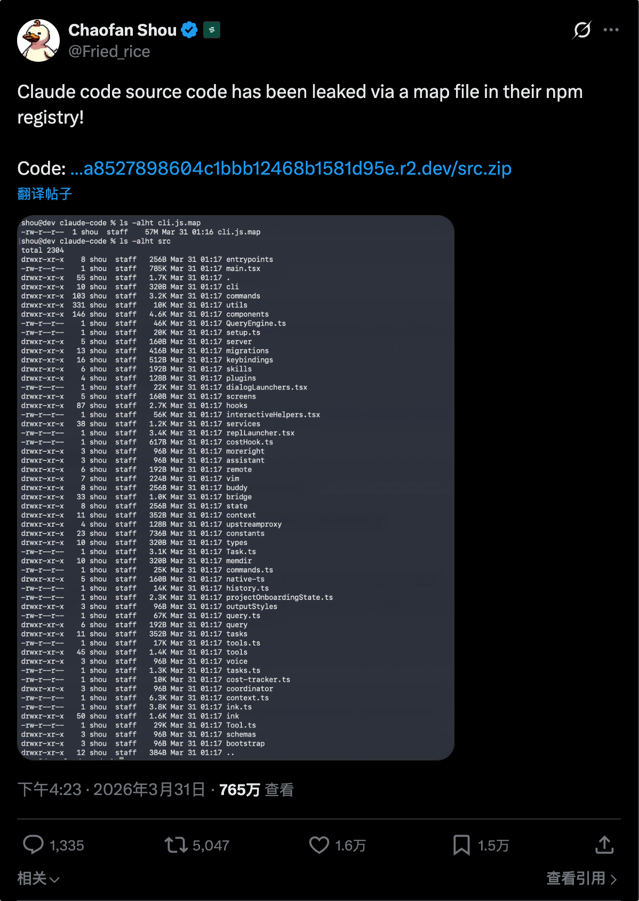

> 免责声明：标题写"我手搓"，但诚实地说，代码是我指挥 AI 搓的。不过话说回来，2026 年了，如果你还在手动敲每一行代码，那你搓的不是 Agent，是寂寞。
>
> 我负责提需求、审代码、理解原理、写这篇文章——等等，文章好像也是 AI 帮我润色的。那我干了什么？**我做了最关键的事：我决定要搓。**

---

## 引子：两个梦

### 梦一：属于自己的编程语言

学生时代，我有一个不太切实际的梦想——写一门属于自己的编程语言。

那时候还在啃龙书、虎书，手写词法分析器、递归下降解析器，用有限自动机的状态转移表把自己搞到怀疑人生。最后勉强搓出来一个能跑四则运算的解释器，觉得自己已经触碰到了计算机科学的终极奥义。

来到了大模型时代，我突然意识到一件事：**Agent 就是新时代的编程语言。**

传统编程语言的核心组件是什么？词法分析器把文本变成 Token，语法分析器把 Token 变成 AST，解释器/编译器遍历 AST 执行操作。Agent 呢？LLM 理解自然语言输入，把它转化成结构化的意图（工具调用），然后执行这些操作，观察结果，继续下一轮。

如果你把 LLM 看作语法分析器，把工具系统看作标准库，把 Agent Loop 看作解释器的 eval 循环——**你就是在编写一门以自然语言为语法的编程语言。**

只不过这次，你不需要手写有限自动机了。

### 梦二：一次意外的源码泄露

2026 年 3 月 31 日，一件大事在 AI 圈炸了锅。

安全研究员在 Claude Code 的 npm 发行包中发现了一个 `.map` 文件（Source Map），这个文件引用了 Anthropic R2 存储桶中**未混淆的 TypeScript 源码**——整个 `src/` 目录可被直接下载。

51 万行 TypeScript。1900 个文件。**目前最完整的商业级 AI Agent 架构实例，就这样赤裸裸地暴露在了公众面前。**



我连夜把源码拉下来读了一遍（好吧，其实是 AI 帮我读的），然后写了一篇[[Claude-Code源码架构深度分析|详细的架构分析]]。

读完之后，一个想法冒了出来：这些东西，看着复杂，**但核心原理其实不难。** 既然能拆解别人的，为什么不自己从零搭一个？

**所以这篇文章的目标很简单：从头手搓一个 AI Agent，理解它的每一行代码在做什么。**

---

## 一、Agent 是什么？

先从 Claude Code 的源码里提炼一个最本质的等式：

> **AI Agent = LLM（大脑）+ 工具调用（手脚）+ 记忆（经验）+ 规划（策略）**

它不是简单的 prompt → response 对话机器人。它是一个能**自主决策、多步执行、使用工具**的智能体。

类比 Claude Code 的五层架构：

| 层次 | Claude Code | 对应概念 |
|---|---|---|
| 入口层 | Commander.js + React/Ink | 用户交互 |
| Agent 循环层 | QueryEngine + query() | **ReAct 核心循环** |
| 工具执行层 | 40+ 个 Tool | **工具系统** |
| 权限控制层 | 7 层规则引擎 | 安全控制 |
| 系统提示层 | 53KB 的 System Prompt | 指令集 / 人格 |

我们要做的，就是从最核心的第 2 层开始——**Agent 循环**。

---

## 二、Agent Loop：一切的心脏

如果整篇文章你只记住一句话，记这句：

> **Agent 的本质就是一个 while 循环——不断让 LLM 思考、调用工具、观察结果，直到任务完成。**

在 Claude Code 的源码里，这个循环由 `query.ts` 实现，状态对象跨迭代传递：

```typescript
// Claude Code 的循环状态（简化版）
type State = {
  messages: Message[]          // 对话历史
  turnCount: number            // 当前轮次
  toolUseContext: ToolUseContext // 工具执行上下文
}
```

而在我们的 Java 手搓版本中，这个循环是这样的：

```java
// AgentLoop.java —— 我们的 ReAct 核心循环
public String run(String userTask) {
    List<ChatMessage> messages = new ArrayList<>();
    messages.add(ChatMessage.system(systemPrompt));
    messages.add(ChatMessage.user(userTask));

    List<Map<String, Object>> toolsSchema = toolRegistry.toOpenAIToolsSchema();

    for (int step = 1; step <= maxSteps; step++) {
        // 1. 调用 LLM
        ChatMessage assistantMsg = llmClient.chat(messages, toolsSchema);
        messages.add(assistantMsg);

        // 2. 检查是否有工具调用
        if (assistantMsg.getToolCalls() != null && !assistantMsg.getToolCalls().isEmpty()) {
            // 有工具调用 → 逐个执行
            for (ChatMessage.ToolCall toolCall : assistantMsg.getToolCalls()) {
                String result = executeTool(toolCall);
                messages.add(ChatMessage.toolResult(toolCall.getId(), result));
            }
        } else {
            // 没有工具调用 → 任务完成
            return assistantMsg.getContent();
        }
    }
    return "达到最大步数限制";
}
```

**对比 Claude Code 和我们的手搓版：**

| 维度 | Claude Code (query.ts) | agent-from-scratch (AgentLoop.java) |
|---|---|---|
| 循环驱动 | AsyncGenerator + yield | for 循环 + return |
| 状态传递 | 显式 State 对象 | messages 列表即状态 |
| 工具执行 | 并发编排器（读写分离） | 串行逐个执行 |
| 中断处理 | AbortController | 暂无 |
| 输出截断恢复 | 最多自动续写 3 次 | 暂无 |

核心逻辑完全一致：**调 LLM → 有 tool_calls 就执行 → 没有就结束。** 那些差异是工程化的打磨，不是本质区别。

### ReAct 模式

这个 "调用 → 观察 → 再调用" 的循环，学术界给它起了个名字叫 **ReAct**（Reasoning + Acting）：

```
Thought: 我需要先查上海天气
Action:  get_weather({"city": "上海"})
Observation: 上海今日小雨，15-20°C
Thought: 有雨，需要计算一年有多少小时
Action:  calculator({"expression": "365 * 24"})
Observation: 8760
Thought: 信息齐了，可以回复用户了
Final Answer: 上海今天小雨...一年共 8760 小时。
```

每一轮 Thought → Action → Observation 就是循环体的一次迭代。LLM 不需要一次性想清楚所有步骤，它可以走一步看一步——**就像人类解决问题一样。**

---

## 三、工具系统：给 Agent 装上手脚

光有大脑不够，Agent 需要和外界交互。这就是工具系统的角色。

在 Claude Code 中，工具系统非常庞大——40+ 个工具，每个都实现统一接口：

```typescript
// Claude Code 的工具接口（简化版）
interface Tool {
  name: string
  description: string
  inputSchema: ZodSchema
  isReadOnly(): boolean
  execute(input, context): Promise<ToolResult>
}
```

我们的 Java 版本简化了一下，但核心思想完全一致：

```java
// Tool.java —— 工具接口
public interface Tool {
    String name();               // 工具名称（唯一标识）
    String description();         // 描述（告诉 LLM 这个工具干什么）
    Map<String, Object> parameters(); // 参数 JSON Schema
    String execute(Map<String, Object> arguments); // 执行
}
```

然后用一个注册表管理所有工具，并能自动生成 OpenAI Function Calling 格式的 schema：

```java
// ToolRegistry.java
public class ToolRegistry {
    private final Map<String, Tool> tools = new LinkedHashMap<>();

    public void register(Tool tool) {
        tools.put(tool.name(), tool);
    }

    // 生成 OpenAI tools 列表，直接塞进 API 请求
    public List<Map<String, Object>> toOpenAIToolsSchema() {
        List<Map<String, Object>> result = new ArrayList<>();
        for (Tool tool : tools.values()) {
            Map<String, Object> functionDef = new LinkedHashMap<>();
            functionDef.put("name", tool.name());
            functionDef.put("description", tool.description());
            functionDef.put("parameters", tool.parameters());

            Map<String, Object> entry = new LinkedHashMap<>();
            entry.put("type", "function");
            entry.put("function", functionDef);
            result.add(entry);
        }
        return result;
    }
}
```

这个设计的精妙之处在于：**LLM 不需要"学会"使用工具——我们只需要在系统提示里告诉它有哪些工具可用，它就能自行判断何时调用、传什么参数。** Function Calling 本质上是 LLM 的结构化输出能力。

### Claude Code 的进阶：读写分离并发

Claude Code 在工具编排上有一个非常精妙的设计——**读写分离**：

- 连续的只读工具 → 合并为一个并发批次（最多 10 个并行）
- 遇到写入工具 → 切断，单独串行执行

这在安全性和性能之间取得了平衡。搜索和读取操作全速并发，文件修改必须有序。我们的 demo 暂时串行执行所有工具，但理解了这个设计后，加一层编排器并不困难。

---

## 四、LLM 客户端：与大脑对话

Agent 需要一个"大脑接口"——封装对 LLM API 的调用。核心是处理两件事：

1. **发送消息列表 + 工具定义** → LLM API
2. **解析响应**：纯文本回复 or 工具调用指令

```java
// LLMClient.java（核心逻辑）
public ChatMessage chat(List<ChatMessage> messages, 
                        List<Map<String, Object>> toolsSchema) throws IOException {
    // 构建请求 JSON
    ObjectNode requestBody = MAPPER.createObjectNode();
    requestBody.put("model", model);
    requestBody.set("messages", serializeMessages(messages));
    
    if (toolsSchema != null && !toolsSchema.isEmpty()) {
        requestBody.set("tools", MAPPER.valueToTree(toolsSchema));
    }

    // 发送 HTTP 请求
    Request request = new Request.Builder()
            .url(baseUrl + "/chat/completions")
            .addHeader("Authorization", "Bearer " + apiKey)
            .post(RequestBody.create(jsonBody, JSON_TYPE))
            .build();

    // 解析响应：提取 content 和 tool_calls
    JsonNode choiceMessage = root.path("choices").get(0).path("message");
    return parseAssistantMessage(choiceMessage);
}
```

**统一消息模型**是整个通信链的基石。我们的 `ChatMessage` 对齐 OpenAI 的消息格式，支持四种角色：

| 角色 | 用途 | 例子 |
|---|---|---|
| `system` | 系统指令 | "你是一个有帮助的 AI 助手。你可以使用以下工具..." |
| `user` | 用户输入 | "帮我查一下上海的天气" |
| `assistant` | LLM 回复 | 纯文本回复 / 工具调用指令 |
| `tool` | 工具执行结果 | "上海天气：小雨，15°C" |

这四种消息在列表中交替出现，形成完整的对话上下文——这就是 Agent 的"短期记忆"。

---

## 五、把零件组装起来

所有组件就绪，组装只需要几行代码：

```java
// Demo00Main.java —— 入口
public static void main(String[] args) {
    // 1. 初始化 LLM 客户端
    LLMClient llmClient = new LLMClient(apiKey, baseUrl, model);

    // 2. 注册工具
    ToolRegistry toolRegistry = new ToolRegistry();
    toolRegistry.register(new CalculatorTool());   // 计算器
    toolRegistry.register(new CurrentTimeTool());   // 当前时间
    toolRegistry.register(new WeatherTool());       // 天气查询（模拟）

    // 3. 创建 Agent（系统提示 + 最大 10 步）
    AgentLoop agent = new AgentLoop(llmClient, toolRegistry, SYSTEM_PROMPT, 10);

    // 4. 交互式对话
    while (true) {
        String input = scanner.nextLine();
        String response = agent.run(input);
        System.out.println("Agent > " + response);
    }
}
```

跑起来的效果：

```
You > 现在几点了？顺便帮我查一下上海天气，如果下雨的话算一下 365 * 24 是多少小时

🔧 调用工具: get_current_time()
📋 工具结果: 当前时间: 2026年03月20日 15:03:28 (星期五)

🔧 调用工具: get_weather({"city": "上海"})
📋 工具结果: 上海天气: 多云转小雨，气温 18°C...

🔧 调用工具: calculator({"expression": "365 * 24"})
📋 工具结果: 8760

Agent > 现在是 2026年3月20日 15:03，上海今天多云转小雨...365天共有 8760 小时。
```

**一个最基础的 Agent 就这样跑起来了。** 没有任何框架依赖，纯手搓，每一行代码都透明。

---

## 六、Agent Loop 的进阶模式

ReAct 只是起点。真实世界的 Agent 系统会根据任务复杂度混合使用多种循环模式。

### 6.1 Plan-and-Execute（计划-执行分离）

先全局规划，再逐步执行，适合复杂多步任务：

```
┌─────────────┐
│  Planner     │ ← 制定完整计划
└──────┬──────┘
       │ 计划: [步骤1, 步骤2, 步骤3...]
       ▼
┌─────────────┐
│  Executor    │ ← 逐步执行每个子任务
└──────┬──────┘
       ▼
┌─────────────┐
│  Replanner   │ ← 根据执行结果调整后续计划
└─────────────┘
```

### 6.2 Reflexion（自我反思）

执行后回头审视，从失败中学习：

```
执行 → 评估 → 反思 → 记住教训 → 重新执行（更好的版本）
```

### 6.3 Multi-Agent（多智能体协作）

Claude Code 就用了这种模式——主 Agent 可以生成子 Agent（Explore、Plan、Verification 等），甚至支持 **Team Swarm 模式**让多个 Worker 并行协作：

```
Coordinator (协调器)
  ├── AgentTool (fork) → Worker A (前端)
  ├── AgentTool (fork) → Worker B (后端)
  └── AgentTool (fork) → Worker C (测试)
       └── Worker 之间通过 SendMessageTool 通信
```

### 模式选择速查表

| 任务复杂度 | 推荐模式 | 示例 |
|---|---|---|
| 简单（1-3步） | ReAct | 查天气、发邮件 |
| 中等（5-10步） | Plan-and-Execute | 写报告、竞品调研 |
| 需要高质量 | Reflexion | 代码生成、文案撰写 |
| 大型复杂 | Multi-Agent | 软件开发、完整项目交付 |
| **实际生产** | **混合方案** | 外层 Plan + 内层 ReAct + 关键节点 Reflexion |

---

## 七、回望 Claude Code：从手搓到工业级

手搓完一个最基础的 Agent 后，再回头看 Claude Code 的 51 万行源码，你会发现那些"复杂"的设计其实都是在同一个核心上做工程化打磨：

| 我们的手搓版 | Claude Code 的工业级实现 |
|---|---|
| `for` 循环 + `return` | AsyncGenerator + yield（流式输出） |
| `messages` 列表就是全部状态 | 显式 State 对象，含压缩追踪、截断恢复 |
| 串行执行工具 | 读写分离并发编排器（max=10） |
| 没有权限检查 | 7 层规则引擎 + 96KB 的 Bash 安全分类器 |
| 固定 System Prompt | 53KB 动态组装（10 个模块 + 上下文注入） |
| 单 Agent | 5 种内建 Agent + Team Swarm 协作 |
| 无 Feature Flag | 17 个编译时 Feature Flag，死代码消除 |

**架构没变，全是工程。** 这就是为什么"手搓"有价值——当你理解了核心原理，那些工程优化就不再神秘，它们只是把一个 for 循环做到了极致。

---

## 八、后续计划

本文完成了最基础的 ReAct Agent（demo00），但 Agent 的世界远不止于此。接下来还会继续手搓：记忆系统（短期 + 长期）、任务规划与分解、自我反思与迭代改进、多智能体协作、RAG 检索增强、流式输出……每个主题一个独立模块，前面的代码不动，逐步叠加，直到把 Agent 的核心知识点全部走通。

零框架依赖的原则不会变——**看清每一行代码在干什么，这就是手搓的意义。**

---

## 尾声

回到开头的那个等式：

> **Agent = LLM + 工具 + 记忆 + 规划**

剥开 51 万行源码的外壳，Claude Code 的核心也不过是一个精心打磨的 while 循环。它调用 LLM 获取下一步指令，执行工具获取观察结果，把结果喂回 LLM 继续推理——如此往复，直到任务完成。

学生时代想写编程语言的梦，现在换了一种形式实现了。词法分析器变成了 LLM 的自然语言理解，标准库变成了工具注册表，eval 循环变成了 Agent Loop。**语法从 `int x = 42;` 变成了 "帮我查一下上海的天气"。**

当年手搓编译器的人，后来都去造了编程语言。现在手搓 Agent 的人，谁知道会造出什么呢？

---

*本文源码：[agent-from-scratch](https://github.com/JingkaiTang/agent-from-scratch)*
*Claude Code 架构分析：[[Claude-Code源码架构深度分析]]*
