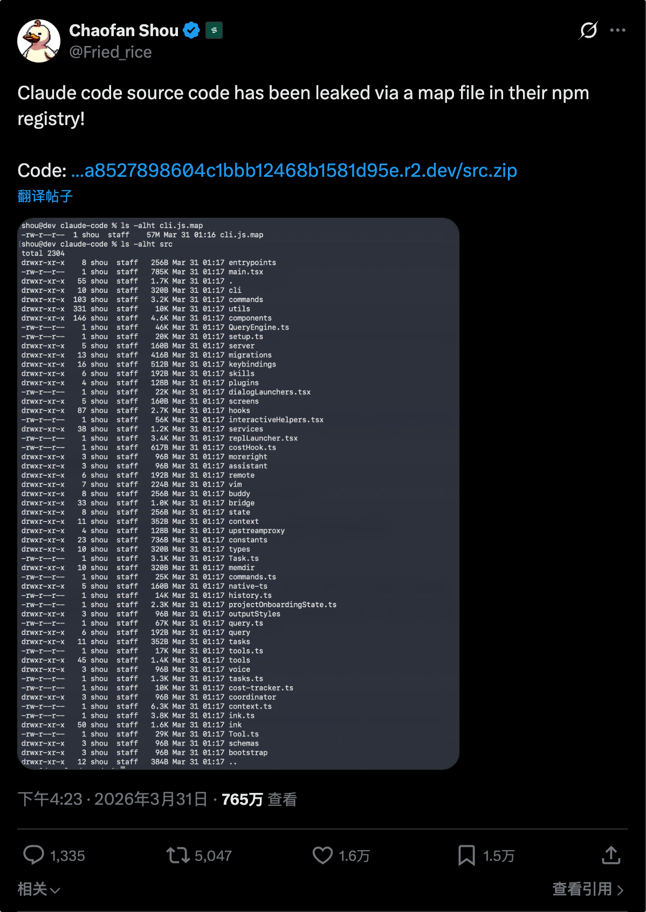
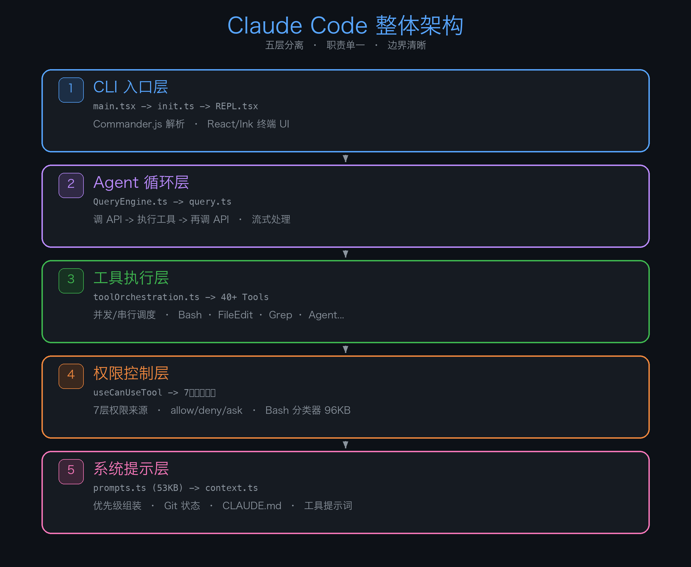
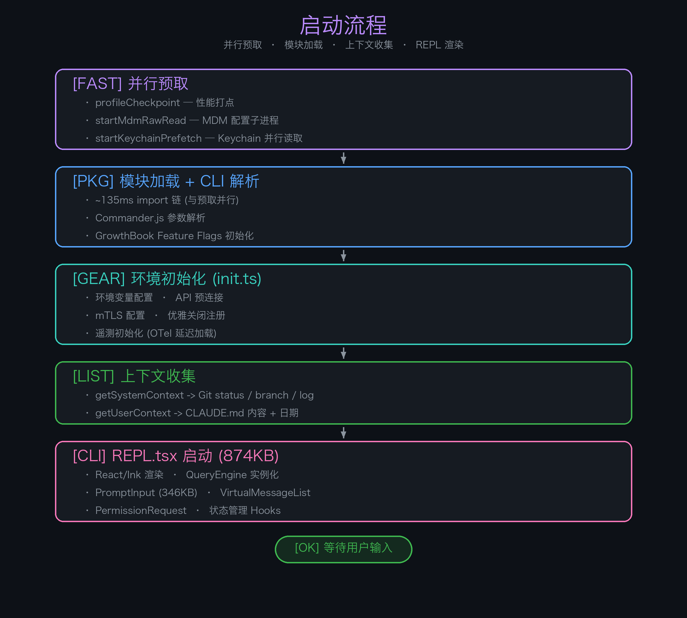
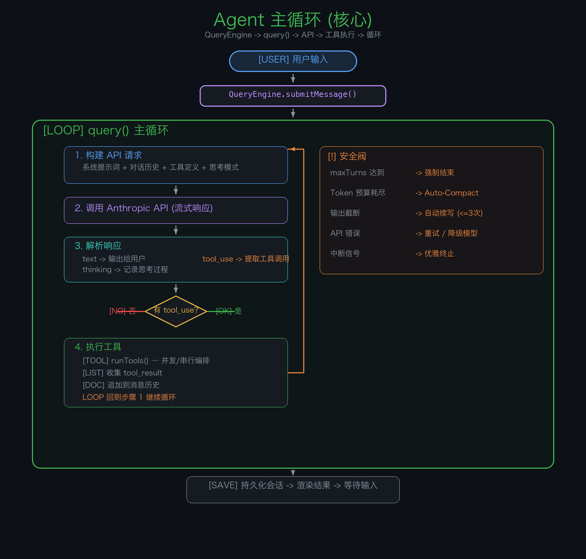
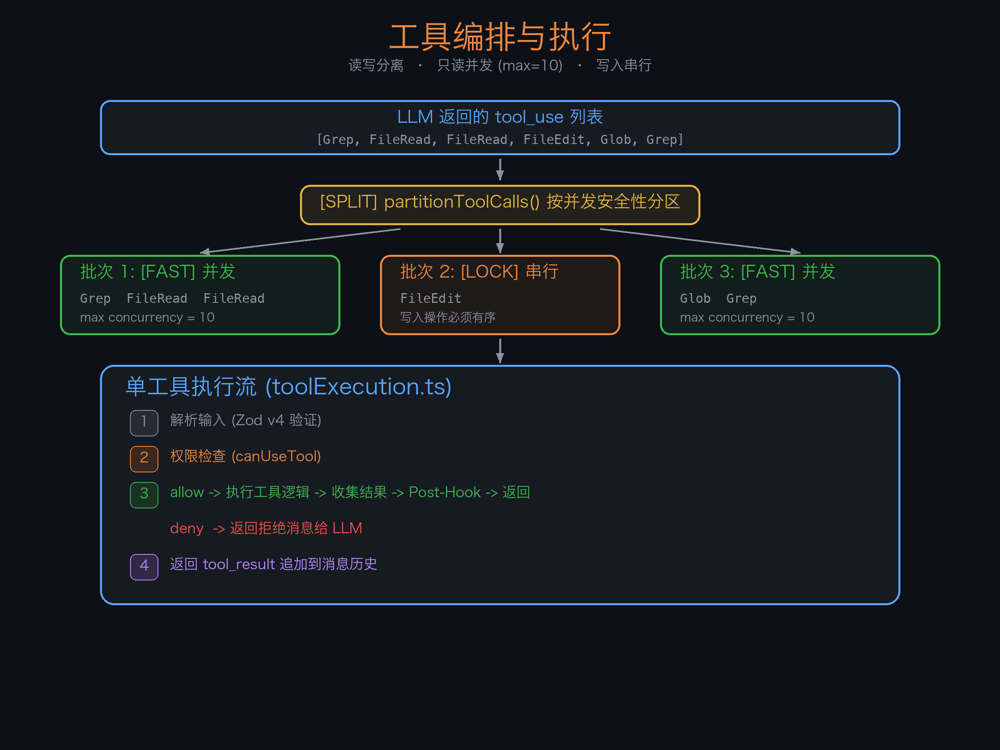
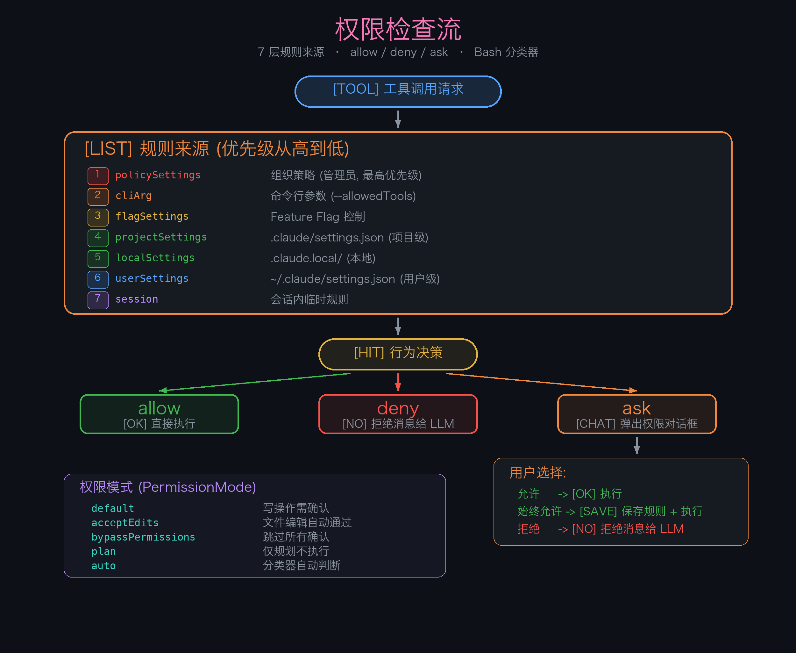
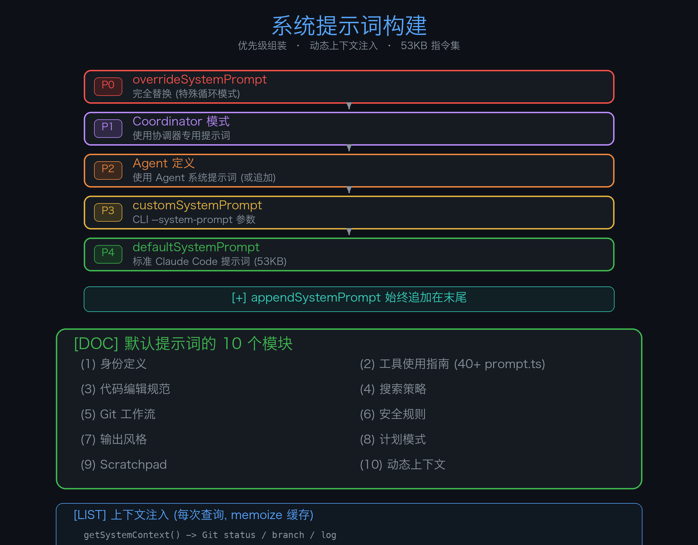
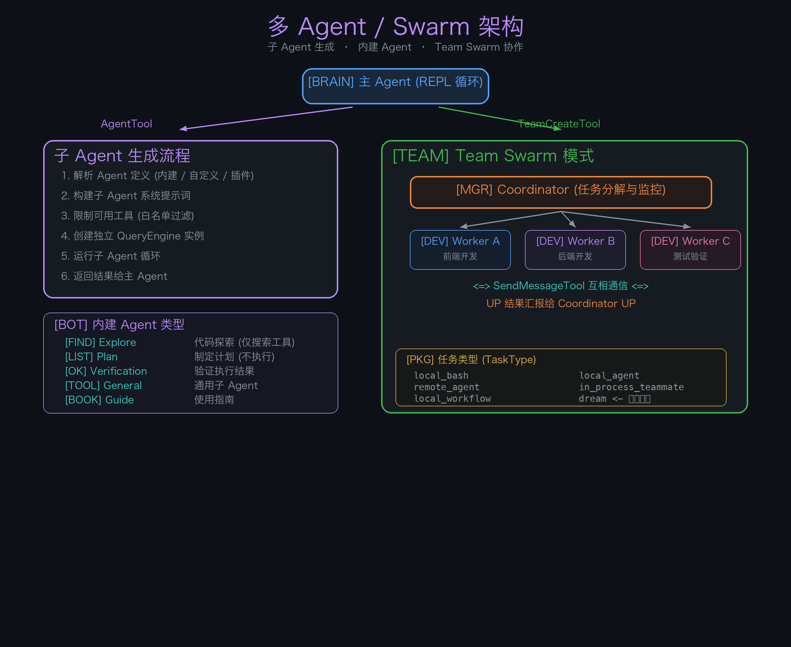

> 2026 年 3 月 31 日，Claude Code 的完整源码因 npm 包中的 `.map` 文件意外暴露。51 万行 TypeScript，1900 个文件——这可能是目前最完整的商业级 AI Agent 架构实例。我（其实是AI）花了一晚上仔细读完了核心模块，把架构和 Agent 循环机制完整拆解出来。

## 泄露经过

安全研究员 [@Fried_rice](https://x.com/Fried_rice/status/2038894956459290963) 发现 Claude Code 的 npm 发行包中包含了一个 `.map` 文件（Source Map），该文件引用了 Anthropic R2 存储桶中未混淆的 TypeScript 源码，导致整个 `src/` 目录可被直接下载。



**项目概况：**

| 项目 | 数据 |
|---|---|
| 语言 | TypeScript (strict) |
| 运行时 | Bun |
| 终端 UI | React + Ink |
| 规模 | ~1,900 文件，512,000+ 行代码 |
| 文件构成 | 494 个 .tsx + 486 个 .ts + 18 个 .js |

---

## 一、整体架构：五层蛋糕

Claude Code 采用清晰的五层架构，每层职责单一：



从上到下：

1. **CLI 入口层** — Commander.js 解析命令行参数，启动 React/Ink 终端 UI
2. **Agent 循环层** — 核心引擎，负责「调 API → 执行工具 → 再调 API」的循环
3. **工具执行层** — 40+ 个工具的注册、调度和执行
4. **权限控制层** — 每次工具调用前的安全检查
5. **系统提示层** — 53KB 的系统提示词构建 + 上下文注入

---

## 二、启动流程：在 import 之间抢跑

Claude Code 的启动优化值得一看。`main.tsx` 利用了一个巧妙的技巧——**在 import 语句之间插入副作用**：

```typescript
// main.tsx 文件开头

import { profileCheckpoint } from './utils/startupProfiler.js';
profileCheckpoint('main_tsx_entry');  // ← 打点

import { startMdmRawRead } from './utils/settings/mdm/rawRead.js';
startMdmRawRead();                    // ← 启动 MDM 子进程

import { startKeychainPrefetch } from './utils/secureStorage/keychainPrefetch.js';
startKeychainPrefetch();              // ← 启动 Keychain 并行读

// 后面才是 ~135ms 的正式 import 链...
import chalk from 'chalk';
import React from 'react';
// ... 100+ imports
```

因为 ES 模块的 import 是**自上而下顺序执行**的，所以 `startMdmRawRead()` 和 `startKeychainPrefetch()` 会在后续大量模块加载期间**并行运行**。这个技巧节省了约 65ms 的冷启动时间。

**完整启动链路：**



---

## 三、Agent 循环：核心中的核心

这是整篇文章最重要的部分。Claude Code 的 Agent 循环由两个核心文件驱动：

- **`QueryEngine.ts`** — 会话引擎，管理整个对话的生命周期
- **`query.ts`** — 查询循环，实现「调 API → 工具执行 → 再调 API」的闭环

### QueryEngine：一个对话一个实例

```typescript
export class QueryEngine {
  private mutableMessages: Message[]        // 完整对话历史
  private abortController: AbortController  // 中断控制
  private totalUsage: NonNullableUsage      // Token 用量
  private readFileState: FileStateCache     // 文件状态缓存

  async *submitMessage(prompt, options): AsyncGenerator<SDKMessage> {
    // 1. 构建系统提示词 (buildEffectiveSystemPrompt)
    // 2. 收集上下文 (Git状态, CLAUDE.md, MCP服务器)
    // 3. 启动 query() 循环
    // 4. yield 流式输出给调用方
    // 5. 持久化会话
  }
}
```

注意它使用了 **AsyncGenerator** 模式——`submitMessage` 是一个异步生成器，通过 `yield` 逐步返回流式结果，调用方可以实时处理每一条消息。

### query()：Agent 循环的核心



**循环状态** 是一个可变对象，跨迭代携带：

```typescript
type State = {
  messages: Message[]                   // 对话历史
  toolUseContext: ToolUseContext        // 工具执行上下文
  turnCount: number                    // 当前轮次
  autoCompactTracking: ...             // 自动压缩追踪
  maxOutputTokensRecoveryCount: number // 输出截断恢复计数 (≤3)
  hasAttemptedReactiveCompact: boolean // 是否尝试过响应式压缩
  transition: Continue | undefined     // 上次循环的继续原因
}
```

**关键细节：** 当 LLM 的输出因 `max_output_tokens` 被截断时，循环不会直接结束，而是**自动续写**，最多重试 3 次。这保证了长回答不会被意外切断。

---

## 四、工具系统：40+ 工具的注册与调度

### 4.1 工具注册表

`tools.ts` 管理所有工具的注册，分三类加载：

```typescript
// 🟢 核心工具 — 始终加载
import { BashTool } from './tools/BashTool/BashTool.js'
import { FileReadTool } from './tools/FileReadTool/FileReadTool.js'
import { FileEditTool } from './tools/FileEditTool/FileEditTool.js'

// 🟡 条件工具 — Feature Flag 编译时控制
const SleepTool = feature('PROACTIVE')
  ? require('./tools/SleepTool/SleepTool.js').SleepTool
  : null  // false 分支在构建时被 Bun 完全删除

// 🔴 内部工具 — 仅 Anthropic 员工可用
const REPLTool = process.env.USER_TYPE === 'ant'
  ? require('./tools/REPLTool/REPLTool.js').REPLTool
  : null
```

### 4.2 工具接口

每个工具必须实现统一接口：

```typescript
interface Tool {
  name: string                           // 工具名
  description: string                    // 给 LLM 的描述
  inputSchema: ZodSchema                 // Zod v4 输入校验

  isReadOnly(): boolean                  // 是否只读（决定能否并发）
  isConcurrencySafe(input): boolean      // 是否并发安全
  needsPermissions(input): boolean       // 是否需要权限检查

  execute(input, context): Promise<ToolResult>   // 执行逻辑
  renderToolUseMessage?(input): ReactElement     // UI 渲染
}
```

### 4.3 工具编排：读写分离的并发策略

这是一个非常精妙的设计。当 LLM 在单次响应中请求多个工具调用时，编排器 (`toolOrchestration.ts`) 不会简单地串行执行，而是：



**规则很简单：**
- 连续的只读工具 → 合并为一个并发批次
- 遇到写入工具 → 切断，单独串行
- 最大并发数 10（可通过环境变量配置）

这在安全性和性能之间取得了很好的平衡——搜索和读取操作全速并发，但文件修改必须有序执行。

### 4.4 完整工具清单

| 类别 | 工具 | 说明 |
|---|---|---|
| **文件操作** | `BashTool` | Shell 命令执行（156KB，最大的工具） |
| | `FileReadTool` | 读取文件（支持图片/PDF/Notebook） |
| | `FileWriteTool` | 创建/覆盖文件 |
| | `FileEditTool` | 字符串替换式编辑 |
| **搜索** | `GrepTool` | ripgrep 内容搜索 |
| | `GlobTool` | 文件模式匹配 |
| | `ToolSearchTool` | 延迟工具发现 |
| **网络** | `WebFetchTool` | 获取 URL 内容 |
| | `WebSearchTool` | 网络搜索 |
| **Agent** | `AgentTool` | 子 Agent 生成（228KB!） |
| | `SendMessageTool` | Agent 间消息传递 |
| | `TeamCreateTool` | 创建 Agent 团队 |
| **任务** | `TaskCreate/Get/Update/List/Stop` | 异步任务管理 |
| | `TodoWriteTool` | Todo 列表 |
| **模式切换** | `EnterPlanModeTool` | 进入计划模式 |
| | `ExitPlanModeTool` | 退出计划模式（118KB!） |
| | `EnterWorktreeTool` | Git Worktree 隔离 |
| **扩展** | `SkillTool` | 技能执行 |
| | `MCPTool` | MCP 服务器调用 |
| | `LSPTool` | 语言服务器协议 |
| **特殊** | `SleepTool` | 主动模式等待 |
| | `SyntheticOutputTool` | 结构化 JSON 输出 |
| | `CronCreateTool` | 定时触发器 |

---

## 五、权限系统：7 层规则引擎

每次工具调用前都经过权限检查。这套系统的复杂度远超预期。



### 5.1 七层规则来源（优先级从高到低）

```
1. policySettings      ← 组织策略（管理员设置，最高优先级）
2. cliArg              ← 命令行参数 (--allowedTools 等)
3. flagSettings        ← Feature Flag 控制
4. projectSettings     ← .claude/settings.json（项目级）
5. localSettings       ← .claude.local/settings.json（本地）
6. userSettings        ← ~/.claude/settings.json（用户级）
7. session             ← 会话内临时规则
```

### 5.2 权限模式

| 模式 | 行为 |
|---|---|
| `default` | 写操作需要用户确认 |
| `acceptEdits` | 文件编辑自动通过，Bash 仍需确认 |
| `bypassPermissions` | 跳过所有确认（危险模式） |
| `plan` | 仅规划不执行 |
| `auto` | 分类器自动判断（实验性） |

### 5.3 Bash 权限分类器：96KB 的安全堡垒

`bashPermissions.ts` 是整个代码库中**第三大文件**（96KB），实现了一个 Shell 命令安全分类器。它会解析每条 shell 命令的语法结构，判断属于哪个安全等级：

- **安全** — `ls`, `cat`, `git status`, `echo` → 直接执行
- **需确认** — `rm`, `mv`, `pip install`, `npm publish` → 弹窗确认
- **危险** — `rm -rf /`, `chmod 777`, `curl | bash` → 强烈警告

分类器使用了 shell 语法解析 + 正则匹配 + 黑白名单的混合策略。Anthropic 在安全上的投入肉眼可见。

---

## 六、系统提示词：53KB 的指令集

### 6.1 优先级组装

系统提示词不是一成不变的，而是按优先级动态组装：



### 6.2 默认提示词的 10 个模块

`getSystemPrompt()` 构建的 53KB 系统提示包含：

1. **身份定义** — "You are Claude, made by Anthropic..."
2. **工具使用指南** — 40+ 工具各自的 `prompt.ts` 拼接
3. **代码编辑规范** — 如何使用 FileEdit 进行精确修改
4. **搜索策略** — 何时用 Grep vs Glob vs Agent
5. **Git 工作流** — 提交、分支管理、PR 规范
6. **安全规则** — 哪些操作绝对不能做
7. **输出风格** — 简洁/详细/结构化等配置
8. **计划模式** — 如何制定和执行计划
9. **Scratchpad** — 临时文件使用规范
10. **动态上下文** — Git 状态快照、CLAUDE.md、当前日期

### 6.3 上下文注入

每次查询都会注入两类上下文（会话内 memoize 缓存）：

```typescript
// 系统上下文
getSystemContext() → {
  gitStatus: "Current branch: main\nStatus: M src/index.ts\n..."
}

// 用户上下文
getUserContext() → {
  claudeMd: "项目名称：...\n编码规范：...",
  currentDate: "Today's date is 2026-03-31."
}
```

---

## 七、多 Agent 架构



### 7.1 五种内建 Agent

| Agent | 职责 | 可用工具 |
|---|---|---|
| **Explore** | 代码探索 | 仅搜索/读取工具 |
| **Plan** | 制定计划 | 搜索/读取 + TodoWrite |
| **Verification** | 验证结果 | 搜索/读取 + Bash |
| **General Purpose** | 通用子任务 | 大部分工具 |
| **Claude Code Guide** | 使用指南 | 仅搜索/读取 |

### 7.2 子 Agent 生成流程

```
主 Agent 决定需要帮助
      │
      ▼
AgentTool.execute({ agent: "explore", prompt: "查找认证代码" })
      │
      ▼
runAgent()
  ├── 解析 Agent 定义（内建 / 自定义 / 插件）
  ├── 构建子 Agent 的系统提示词
  ├── 限制可用工具（白名单过滤）
  ├── 创建独立的 QueryEngine 实例
  ├── 运行子 Agent 循环（与主循环相同的机制）
  │   ├── 子 Agent 使用工具搜索/读取
  │   └── 循环直到完成
  └── 结果返回给主 Agent 继续处理
```

### 7.3 Team Swarm 模式

更进一步，Claude Code 支持**多 Agent 并行协作**：

```
Coordinator (协调器角色)
  │
  ├── TeamCreateTool → 创建团队
  │
  ├── AgentTool (fork) → Worker A (前端)
  ├── AgentTool (fork) → Worker B (后端)
  └── AgentTool (fork) → Worker C (测试)
       │
       ├── Worker 之间通过 SendMessageTool 通信
       └── 完成后结果汇报给 Coordinator
```

协调器模式 (`coordinatorMode.ts`) 有一套独立的系统提示词，让主 Agent 扮演项目经理——分解任务、分配给 Worker、监控进度、汇总结果。

### 7.4 任务类型

```typescript
type TaskType =
  | 'local_bash'           // 本地 Shell 任务
  | 'local_agent'          // 本地 Agent
  | 'remote_agent'         // 远程 Agent
  | 'in_process_teammate'  // 进程内团队成员
  | 'local_workflow'       // 本地工作流
  | 'monitor_mcp'          // MCP 监控
  | 'dream'                // 自动记忆整理（是的，Agent 会"做梦"）
```

---

## 八、Feature Flag：编译时消灭死代码

Claude Code 通过 Bun 的 `bun:bundle` 实现了**编译时 Feature Flag**：

```typescript
import { feature } from 'bun:bundle'

// 编译时求值，false 分支整个被删除
const voiceCommand = feature('VOICE_MODE')
  ? require('./commands/voice/index.js').default
  : null  // 构建后这行连同 require 都不存在
```

这比运行时 `if/else` 更彻底——构建产物中完全不包含未启用功能的代码。

**已发现的 17 个 Feature Flag：**

| Flag | 功能 | 状态推测 |
|---|---|---|
| `BRIDGE_MODE` | VS Code / JetBrains 集成 | 已启用 |
| `AGENT_TRIGGERS` | 定时触发器 | 已启用 |
| `TOKEN_BUDGET` | Token 预算控制 | 已启用 |
| `HISTORY_SNIP` | 历史修剪 | 已启用 |
| `PROACTIVE` | 主动模式 | 实验中 |
| `KAIROS` | 独立助手模式 | 实验中 |
| `COORDINATOR_MODE` | 多 Agent 协调器 | 实验中 |
| `VOICE_MODE` | 语音输入 | 实验中 |
| `DAEMON` | 守护进程 | 实验中 |
| `REACTIVE_COMPACT` | 响应式上下文压缩 | 实验中 |
| `CONTEXT_COLLAPSE` | 上下文折叠 | 实验中 |
| `TRANSCRIPT_CLASSIFIER` | 转录分类器 | 实验中 |
| `MONITOR_TOOL` | 监控工具 | 开发中 |
| `BG_SESSIONS` | 后台会话 | 开发中 |
| `EXPERIMENTAL_SKILL_SEARCH` | 技能搜索 | 开发中 |
| `CACHED_MICROCOMPACT` | 缓存微压缩 | 开发中 |
| `AGENT_TRIGGERS_REMOTE` | 远程触发器 | 开发中 |

---

## 九、Bridge 系统：IDE 双向通道

Claude Code 不只是命令行工具，它通过 Bridge 系统与 IDE 扩展双向通信：

```
┌──────────────┐    WebSocket/IPC     ┌──────────────┐
│  VS Code /   │ ◄═══════════════════► │  Claude Code  │
│  JetBrains   │   bridgeMessaging.ts  │  CLI          │
│  Extension   │                       │               │
│              │    JWT 认证           │  bridgeMain   │
│  · 编辑器同步│ ◄═══════════════════► │  .ts (112KB)  │
│  · 权限代理  │   bridgePermission    │  · 会话管理   │
│  · UI 渲染   │   Callbacks.ts        │  · 消息转发   │
└──────────────┘                       └──────────────┘
```

---

## 十、技术栈一览

| 类别 | 技术选型 |
|---|---|
| 运行时 | **Bun** |
| 语言 | TypeScript (strict mode) |
| 终端 UI | React + **Ink** (自定义 fork) |
| CLI 解析 | Commander.js (extra-typings) |
| Schema 验证 | **Zod v4** |
| 代码搜索 | **ripgrep** |
| 协议 | MCP SDK, LSP |
| API 客户端 | Anthropic SDK |
| 遥测 | OpenTelemetry + gRPC（延迟加载） |
| Feature Flags | GrowthBook |
| 认证 | OAuth 2.0, JWT, macOS Keychain |
| 构建 | bun:bundle（编译时死代码消除） |

---

## 十一、关键设计模式

### 1. AsyncGenerator 驱动一切

从 `QueryEngine.submitMessage()` 到 `query()` 到 `runTools()`，整条链路都是 AsyncGenerator。这使得流式输出、工具进度更新、中断处理都自然地融入了同一套控制流。

### 2. 编译时死代码消除

`feature()` 在 Bun 构建时求值，false 分支连同 `require()` 调用一起被删除。发布包不包含任何未启用功能的代码。

### 3. 延迟加载重模块

OpenTelemetry (~400KB) 和 gRPC (~700KB) 不在启动时加载，而是在首次使用时 `import()`。

### 4. Memoize 避免重复计算

`getSystemContext()` 和 `getUserContext()` 使用 lodash 的 `memoize`，整个会话生命周期内只计算一次。

### 5. 大量 require() 打破循环依赖

由于模块间关系复杂，代码中大量使用了 `require()` 延迟导入来打破循环依赖：

```typescript
const getTeammateUtils = () =>
  require('./utils/teammate.js') as typeof import('./utils/teammate.js')
```

### 6. 读写分离的工具并发

只读工具并发执行（max=10），写入工具串行执行。简单的分区算法，效果显著。

---

## 十二、有趣的发现

1. **`REPL.tsx` 874KB** — 单文件最大，整个交互界面都在这一个 React 组件里
2. **`PromptInput.tsx` 346KB** — 一个输入框组件比大多数完整项目都大
3. **`bashPermissions.ts` 96KB** — Shell 安全分类器，Anthropic 对安全的偏执程度可见一斑
4. **`USER_TYPE === 'ant'`** — Anthropic 员工有隐藏工具（REPLTool、SuggestBackgroundPRTool）
5. **`dream` 任务类型** — Agent 空闲时会"做梦"自动整理记忆
6. **`undercover` 模式** — 存在一个「卧底模式」（`utils/undercover.ts`），用途不明
7. **`buddy/` 模块** — 有一个「伙伴精灵」系统（companion sprite），像是桌面宠物？
8. **`KAIROS`** — 一个独立助手模式的 Feature Flag，可能是面向消费者的产品方向
9. **`Pewter Ledger`** — Plan Mode V2 的内部代号（锡制账本？）
10. **输出截断自动续写** — LLM 输出被 `max_output_tokens` 截断时，最多自动续写 3 次

---

## 总结

读完 51 万行源码后，几个核心印象：

**架构清晰度**：五层分层非常干净，每层职责明确。Agent 循环的 AsyncGenerator 设计优雅地统一了流式输出、工具执行、中断处理。

**安全投入**：96KB 的 Bash 权限分类器、7 层权限规则引擎、编译时 Feature Flag 死代码消除——Anthropic 在安全上的投入是认真的。

**工程成熟度**：并行预取、延迟加载、读写分离并发、循环依赖处理——这些工程优化说明团队有丰富的大型项目经验。

**产品野心**：从 Feature Flag 看，Claude Code 远不止是一个命令行工具。KAIROS（独立助手）、PROACTIVE（主动模式）、COORDINATOR_MODE（多 Agent 协调）、VOICE_MODE（语音）——Anthropic 正在把它打造成一个全方位的 AI Agent 平台。

这是目前能看到的**最完整的商业级 AI Agent 架构**。对于任何想要构建 AI Agent 产品的团队来说，这份源码都是一份极有价值的参考。

---

*分析时间：2026-03-31 | 源码来源：npm registry .map 文件泄露*