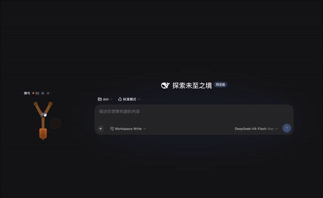

DeepSeek 这周连放了两枪。8 月 12 日深夜上线 V4 Pro 正式版，隔了十几个小时，又把 DeepSeek Harness（简称 dsh）开源推上 GitHub，发布第一天 Star 冲到将近 40k。

大家都在研究它的架构和跑分，我干了件别的。我给它写了一个弹弓插件。

装上之后，dsh 网页界面的右下角会多出一把木头弹弓。按住皮兜往后拉，屏幕上出现一条虚线弹道，松手，石子飞出去，碰到的第一个界面元素当场碎成一地。碎片带着重力滚出屏幕，掉干净以后，原来的元素又弹回原位，界面完好无损。

别人写插件是给 Agent 加能力，我这个插件只负责搞破坏，还保证不搞出真的破坏。

## dsh 是什么

官方给 dsh 的设计原则只有六个字，一切皆插件。模型、工具、沙箱，连界面 UI 在内都是插件，可以自由替换组合。

Claude Code 那类产品也能装插件，可骨架是官方定死的，dsh 把骨架也交给了插件。

装 dsh 也简单，本机有 Node.js 的话，一条命令就能跑起来。

~~~bash
npx @deepseek-ai/dsh web
~~~

浏览器打开 127.0.0.1:3080，在设置里填上 API Key，选一个工作区目录，就能开始用了。

打算长期用可以全局安装，`npm install -g @deepseek-ai/dsh`，以后直接敲 `dsh web`。

我的弹弓就挂在 UI 这一层，纯粹往网页界面上加个玩具。社区里也有不少正经插件，增强功能的、改皮肤的都有。

## 藏在里面的细节

弹弓树干底下有个皮质握把，按住可以把整把弓拖到屏幕任何位置，刷新页面也跑不了。

音效全部用 WebAudio 现场合成，不带一个音频文件，可以一键静音。不想玩了点 ✕，弹弓收成一个小按钮。

打中有记分。整个玩具零依赖，改完代码保存，页面上的插件直接热替换，不用刷新。

## 怎么安装

> 这一小节其实是废话，直接把仓库地址丢给 dsh，它会帮你搞定。

装弹弓分两步，先把包装进 profile 的模块解析路径，再在 `~/.dsh/profiles/web/cordis.patch.yml` 里注册一行。

~~~bash
dsh plugin --profile web add "github:JingkaiTang/dsh-client-ui-slingshot#main"
~~~

~~~yaml
- insert:
    - id: ui-slingshot
      name: '@t7kai/dsh-client-ui-slingshot'
~~~

配置层热生效，不用重启。刷新浏览器页面，弹弓就出现在右下角。

也可以从社区插件超市 dshfind 直接装。

弹弓已经开源，欢迎来打。

*项目源码 [dsh-client-ui-slingshot](https://github.com/JingkaiTang/dsh-client-ui-slingshot)*
