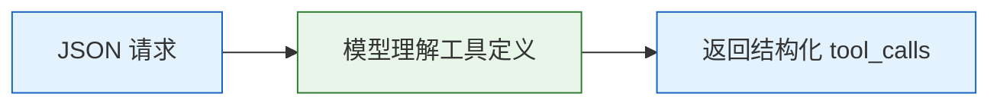
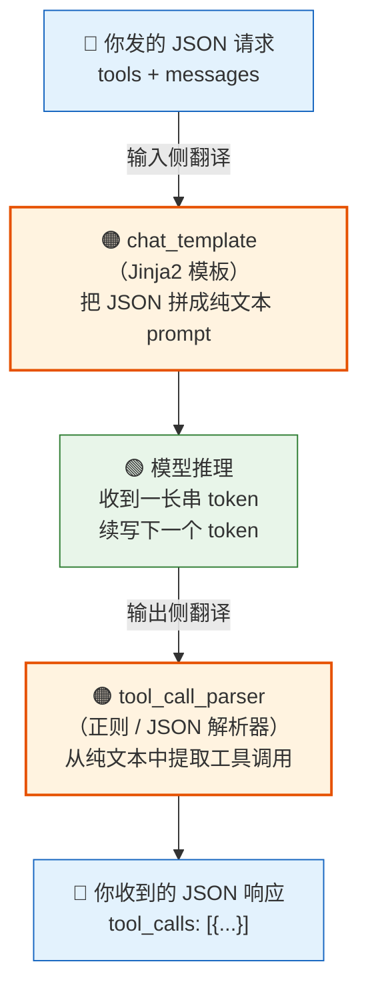
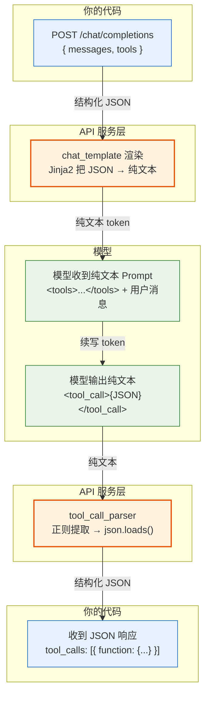
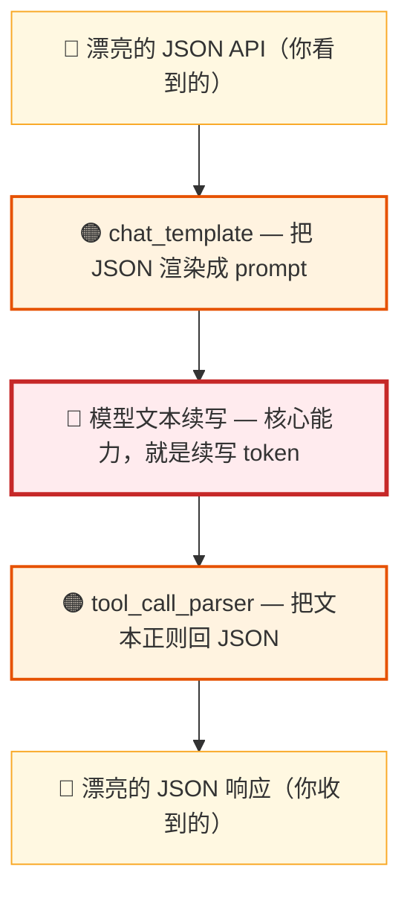

# Function Calling 的真相：从 chat_template 到 tool_call_parser

> 上篇文章发出后，有朋友留言：
>
> *"function call 其实还是通过 prompt 约定的，模型并不是返回的结构化数据，API 层依然是通过正则处理的。可以看下 vLLM 项目中的 tool_call_parser 是如何处理的，开源模型基本都带 chat_template，里面有 function 是如何转化成具体的 prompt。"*
>
> 说得太对了。上篇我们揭开了第一层：**模型不会调用工具，只是输出了一段 JSON。** 但这还不是最底层。今天再往下挖一层——**模型甚至没有输出"JSON"，它只是在续写文本，API 层用正则把文本翻译成了 JSON 给你看。**

---

## 一、你以为的 vs 实际发生的

当你调用一个 OpenAI 兼容的 Chat Completion API，传入 `tools` 参数时，你以为的流程是这样的：



**实际发生的：**



**从头到尾，模型处理的都是纯文本。** "结构化 API"是输入侧和输出侧两个翻译层联手制造的抽象。

---

## 二、输入侧：chat_template 把 JSON 变成 Prompt

### 2.1 什么是 chat_template

每个开源模型的 tokenizer 配置（`tokenizer_config.json`）里都有一个 `chat_template` 字段，它是一段 **Jinja2 模板**，负责把结构化的对话消息 + 工具定义，渲染成模型训练时见过的纯文本格式。

简单说：**chat_template 是"结构化 JSON"到"模型输入文本"的翻译器。**

### 2.2 以 Qwen3.5 为例

Qwen3.5 延续了 Qwen 系列的 chat_template 风格（简化后的核心逻辑）：

```jinja2

    <|im_start|>system
    {{ system_message }}

    # Tools

    You may call one or more functions to assist with the user query.

    You are provided with function signatures within <tools></tools> XML tags:
    <tools>
    
    {{ tool | tojson }}
    
    </tools>

    For each function call, return a json object with function name and arguments
    within <tool_call></tool_call> XML tags:
    <tool_call>
    {"name": <function-name>, "arguments": <args-json-object>}
    </tool_call><|im_end|>

    <|im_start|>system
    {{ system_message }}<|im_end|>

```

**翻译一下这段模板在做什么：**

1. 如果请求里有 `tools` 字段 → 走工具模式
2. 把所有工具定义用 `tojson` 过滤器转成 JSON 字符串，塞进 `<tools>` XML 标签
3. 在后面附上调用格式说明："用 `<tool_call>` 标签包裹 JSON"
4. 如果没有 `tools` → 走普通对话模式

### 2.3 渲染结果：模型实际看到的 Prompt

假设我们发了这样的 API 请求：

```json
{
  "tools": [
    {"type": "function", "function": {"name": "get_weather", "description": "查询天气", "parameters": {...}}},
    {"type": "function", "function": {"name": "calculator", "description": "计算器", "parameters": {...}}}
  ],
  "messages": [
    {"role": "user", "content": "上海明天下雨吗？"}
  ]
}
```

经过 chat_template 渲染后，模型实际收到的是这样一段纯文本：

```
<|im_start|>system
You are Qwen, created by Alibaba Cloud. You are a helpful assistant.

# Tools

You may call one or more functions to assist with the user query.

You are provided with function signatures within <tools></tools> XML tags:
<tools>
{"type": "function", "function": {"name": "get_weather", "description": "查询天气", "parameters": {...}}}
{"type": "function", "function": {"name": "calculator", "description": "计算器", "parameters": {...}}}
</tools>

For each function call, return a json object with function name and arguments within <tool_call></tool_call> XML tags:
<tool_call>
{"name": <function-name>, "arguments": <args-json-object>}
</tool_call><|im_end|>
<|im_start|>user
上海明天下雨吗？<|im_end|>
<|im_start|>assistant
```

**看到了吗？你精心构造的 `tools` JSON Schema，到了模型眼里就是系统提示词里的一段文本。** 模型是通过"阅读"这段文本来了解有哪些工具可用的——和你在 prompt 里手写"你可以使用以下工具"本质上没有任何区别。

### 2.4 工具结果也是文本拼接

模板中处理 `tool` 角色消息（工具执行结果）的逻辑也很有趣：

```jinja2

    <|im_start|>user
    <tool_response>
    {{ message.content }}
    </tool_response><|im_end|>
```

工具结果被包裹在 `<tool_response>` 标签里，**而且被塞进了 `user` 角色的消息中**。因为模型训练时就是这么见到工具结果的——它不认识什么 `tool` 角色，它只知道 `user` 消息里如果出现了 `<tool_response>` 标签，那就是工具的返回值。

---

## 三、输出侧：tool_call_parser 把文本变回 JSON

### 3.1 模型到底输出了什么

当模型"决定"调用工具时，它输出的是这样一段纯文本：

```
<tool_call>
{"name": "get_weather", "arguments": {"city": "上海"}}
</tool_call>
```

这就是普通的文本续写。模型在训练阶段见过大量这种格式的样本——"当你需要调用工具时，输出 `<tool_call>` 标签包裹的 JSON"——所以它学会了在合适的时机生成这种格式。

**它不知道自己在"调用函数"。它只知道，根据上下文，下一段文本大概率应该长这样。**

### 3.2 vLLM 的 Hermes Parser：正则的艺术

这段文本怎么变成 API 响应里干净的 `tool_calls` JSON？看看 vLLM 的 `hermes_tool_parser.py`，核心就是一行正则：

```python
self.tool_call_regex = re.compile(
    r"<tool_call>(.*?)</tool_call>|<tool_call>(.*)", re.DOTALL
)
```

**拆解这行正则：**

| 部分 | 含义 |
|---|---|
| `<tool_call>(.*?)</tool_call>` | 匹配完整的工具调用（有开始和结束标签） |
| `\|` | 或者 |
| `<tool_call>(.*)` | 匹配只有开始标签的情况（流式输出中尚未结束） |
| `re.DOTALL` | 让 `.` 也匹配换行符 |

### 3.3 完整的解析流程

`extract_tool_calls` 方法的完整逻辑：

```python
def extract_tool_calls(self, model_output: str, request) -> ExtractedToolCallInformation:

    # 1. 快速检查：有没有 <tool_call> 标签？
    if "<tool_call>" not in model_output:
        return ExtractedToolCallInformation(tools_called=False, tool_calls=[], content=model_output)

    # 2. 正则提取
    function_call_tuples = self.tool_call_regex.findall(model_output)

    # 3. JSON 解析
    raw_function_calls = [
        json.loads(match[0] if match[0] else match[1])
        for match in function_call_tuples
    ]

    # 4. 封装成 OpenAI 格式
    tool_calls = [
        ToolCall(
            type="function",
            function=FunctionCall(
                name=fc["name"],
                arguments=json.dumps(fc["arguments"], ensure_ascii=False),
            ),
        )
        for fc in raw_function_calls
    ]

    # 5. 提取 <tool_call> 之前的文本作为 content
    content = model_output[:model_output.index("<tool_call>")].strip() or None

    return ExtractedToolCallInformation(tools_called=True, tool_calls=tool_calls, content=content)
```

**就是这么朴素。** 正则匹配 → JSON 解析 → 封装对象。没有什么深度学习，没有什么语义理解——纯粹的字符串处理。

### 3.4 解析失败了呢？

整个过程包裹在 `try-except` 里。模型输出的 JSON 格式有误（少个引号、多个逗号），parser 就会失败，回退到返回原始文本。这就是 function calling 偶尔"抽风"的真相——**不是"调用失败"，而是"文本续写得不够规范"。**

---

## 四、不同模型，不同方言

如果所有模型都用同一种格式，事情就简单了。但现实是——**每个模型家族都有自己的"方言"。**

### 4.1 当前主流模型格式对比

**Qwen3.5** — XML 标签包裹 JSON，支持思维链开关：

```
<tool_call>
{"name": "get_weather", "arguments": {"city": "上海"}}
</tool_call>
```

**DeepSeek V3.2** — 先思考再调用，思考链和工具调用混合输出：

```
<think>用户想知道上海天气，我需要调用天气工具查询...</think>
<tool_call>
{"name": "get_weather", "arguments": {"city": "上海"}}
</tool_call>
```

**MiniMax M2.5** — 用嵌套 XML 而非 JSON 表达参数：

```xml
<tool_call>
<invoke name="get_weather">
<parameter name="city">上海</parameter>
</invoke>
</tool_call>
```

**GLM-5** — 使用特殊 token 作为标签：

```
<|tool_call|>
{"name": "get_weather", "arguments": {"city": "上海"}}
<|end_tool_call|>
```

**Llama 4** — 直接输出 Python 函数调用语法：

```python
[get_weather(city="上海")]
```

仅上面这五家，就已经出现了四种完全不同的格式——XML 标签、思考链混合、嵌套 XML、特殊 token、Python 语法。而这还只是冰山一角：vLLM 官方截至 2026 年 3 月已经维护了 **20+ 个 parser**（hermes、deepseek_v32、minimax、glm47、llama4_pythonic、mistral、kimi_k2、hunyuan_a13b……），几乎每个主流模型都有自己的"翻译器"。

**每个 parser 干的事情都一样：从模型输出的纯文本中，用正则或特定逻辑提取出工具调用信息，翻译成 OpenAI 格式的 `tool_calls`。** 只是每个模型训练时约定的"暗号"不同。

### 4.2 闭源模型呢？

GPT-5、Claude 4、Gemini——它们也是这样实现的吗？

**我们不知道具体实现，但有充分的理由相信底层原理一致。** Transformer 架构的本质是 token 序列到 token 序列，不存在什么"原生结构化输出通道"。安全研究人员多次从 GPT 和 Claude 中提取出完整的 system prompt，发现工具描述确实被拼接在了系统提示词里；Claude Code 的 53KB 系统提示词里也有 40+ 个工具的文本描述。

闭源厂商的优势在于：更充分的训练数据让输出更稳定、更鲁棒的解析器提高容错率、受限解码在生成时就约束输出格式。**但本质不变——输入是 prompt，输出是文本，中间是翻译层。**

---

## 五、全景图：一次 Function Calling 的完整旅程



**三步变换，两层翻译。** 你看到的"结构化 API"，是 chat_template 和 tool_call_parser 联手制造的优雅抽象。

---

## 六、这意味着什么？

理解了这一层之后，几个之前的"迷惑行为"就有了合理的解释：

### 6.1 为什么 Function Calling 有时会"幻觉"

模型偶尔会调用你根本没定义的工具，或者参数格式不对。这不是 bug——**因为模型只是在续写文本，它可能续写出训练数据里见过但你没提供的工具名。** 就像你让一个人按格式填表，他有时候也会写错。

### 6.2 为什么不同模型的 Function Calling 质量差异这么大

因为**训练数据的质量和数量决定了一切**。模型在 function calling 上的表现，取决于它在训练时见过多少格式正确的工具调用样本。大模型见得多、学得好，小模型可能格式都续写不对。

### 6.3 为什么你可以不用 tools 参数也能让模型"调用工具"

完全可以。你只需要在 system prompt 里手动写上工具定义和调用格式，然后自己解析模型输出。**chat_template 帮你做的事，你可以自己做。** 事实上，在 Function Calling API 出现之前，大家就是这么做的。

### 6.4 为什么 vLLM 启动时要指定 --tool-call-parser

因为不同模型的"方言"不同。vLLM 不可能自动猜出模型会用什么格式输出工具调用——你得告诉它用哪个 parser。**选错了 parser = 正则匹配不上 = function calling 失效。**

---

## 七、抽象的价值

揭开真相不是为了否定 Function Calling API——恰恰相反，**抽象的价值在于屏蔽复杂性。**

你不需要知道 TCP 三次握手也能写 HTTP 请求。你不需要知道 chat_template 的 Jinja2 语法也能用 function calling。你不需要知道 tool_call_parser 的正则表达式也能让 Agent 调用工具。

但**知道了，你就不会把它当成魔法。** 当 function calling 出了问题，你知道该去哪里排查：

- 工具定义写得不清楚？→ 模型在 prompt 里看到的描述不够好
- 模型老是调用错误的工具？→ 训练数据对这个格式的覆盖不足
- 输出格式偶尔解析失败？→ 模型文本续写的稳定性问题
- 换了个模型就不工作了？→ chat_template 和 parser 没配对

**所有问题都可以沿着这条链路去定位：JSON → prompt → 文本续写 → 正则解析 → JSON。**

---

## 总结

Function Calling 不是什么高深的模型能力，它是一个**三明治结构**：



上层面包和下层面包是两个翻译层，负责让你用干净的 JSON 与模型交互。中间的馅料是模型的真实能力——理解上下文，续写出格式正确的文本。

知道了三明治的结构，你就既能享受 API 的便利，也能在出问题时掀开面包看看馅料。

---

*上一篇：[Agent 底层原理解析：模型是怎么"调用工具"的？](/writing/agent-tool-calling-principles)*
*系列首篇：[Claude Code 泄露 51 万行源码，我用 Java 手搓了同款 Agent](/writing/build-ai-agent-from-scratch)*
*本文源码：[agent-from-scratch](https://github.com/JingkaiTang/agent-from-scratch)*
