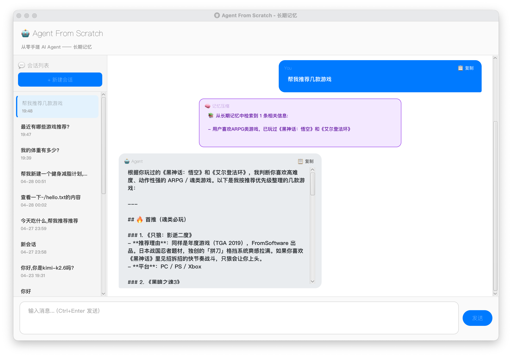

> 上一篇我们给 Agent 加上了短期记忆，解决的是「一轮对话别把上下文撑爆」。但新问题很快来了：**只要重新开一个会话，它又不认识你了。** 今天这篇 demo05，就给 Agent 装一个最小可用的长期记忆。

上一篇刚给 Agent 装上短期记忆。

效果还不错。至少在一次聊天里，它不会聊着聊着把前文忘干净，也不会因为上下文太长直接把自己撑死。

但我很快发现一个更尴尬的问题。

只要新开一个会话，Agent 又失忆了。

你昨天刚告诉它：你叫小明，是 Java 开发者，项目用 Maven，喜欢中文回复。

今天一打开，它看你的眼神又清澈又陌生。

像极了一个每天都第一天上班的服务员。

不是哥们，我昨天才办的会员卡。

所以 demo05 要解决的事很简单：让 Agent 记住跨会话的东西。

你是谁。

你喜欢什么。

你正在做什么项目。

别每次见面都要重新相亲。

---

## 一、短期记忆和长期记忆不是一回事

短期记忆解决的是：**这一轮聊天别爆上下文。**

长期记忆解决的是：**下一轮聊天别装不认识。**

这俩名字都叫「记忆」，但站的位置完全不同。

短期记忆更像开会时桌上的草稿纸。

你正在讨论什么、刚刚调了什么工具、上一步报了什么错，都在这张草稿纸上。会议结束之后，它可以被压缩、丢弃，甚至只留一段会议纪要。

长期记忆更像抽屉里的小本本。

它不关心刚才第几轮对话说了什么，它只关心那些以后还会用到的事实：用户是谁、偏好是什么、项目背景是什么、有哪些长期约定。

所以 demo04 和 demo05 的区别可以一句话概括：

- demo04：别让当前会话撑爆。
- demo05：别让新会话失忆。

Agent 不需要把每一句废话都记住。

但它至少应该记得：我昨天已经自我介绍过了。

---

## 二、这次的实现朴素到有点寒酸

demo05 没有上向量数据库，也没有 embedding。

就一个文件。

`~/.afs/memories.md`

内容长这样：

```markdown
# Agent 长期记忆

## 2026-04-14 10:30
- 用户名叫小明，是一名 Java 开发者
- 用户偏好使用中文回复

## 2026-04-14 11:15
- 用户的项目使用 Maven 构建，Java 25
```

坦率地讲，这东西看起来不像长期记忆系统。

更像一个实习生偷偷维护的用户小抄。

但我反而觉得，它很适合教学 demo。

因为它把长期记忆最关键的三个动作暴露得很清楚：

1. 写进去。
2. 找出来。
3. 塞回上下文。

至于向量库、索引、去重、冲突合并、权限隔离，这些当然重要。

但一上来就把全家桶端出来，读者很容易被工程细节糊一脸。

看完只剩一句感受：哇，好复杂。

这不是我想要的。

这个系列一直想做的事，是把 Agent 拆到能看见骨头。

先让它能跑。

再谈跑得优雅。

---

## 三、写入时，让 LLM 判断哪些事值得记

长期记忆最怕什么？

不是记不住。

是乱记。

如果 Agent 把每一句话都存下来，`memories.md` 迟早会变成聊天记录垃圾场。

你说一句「早上好」，它记住了。

你说一句「帮我看看这个报错」，它也记住了。

你骂一句「这破依赖怎么又炸了」，它还记住了。

几天之后再检索，满屏都是情绪垃圾，跟在工位抽屉里翻发票差不多。

所以 demo05 的写入不是简单保存原文。

它是在每轮对话结束后，让 `MemoryExtractor` 拿着完整对话去问 LLM：

哪些东西值得长期记住？

Prompt 大概约束了两类内容。

值得记的：

- 用户姓名、职业、偏好。
- 项目名称、技术栈、长期目标。
- 用户明确要求「记住」的事项。
- 以后跨会话还会用到的稳定事实。

不值得记的：

- 闲聊问候。
- 临时指令。
- 工具调用过程。
- 普普通通的常识。
- 一次性的情绪输出。

然后 LLM 返回一个 JSON 数组：

```json
["用户名叫小明，是一名 Java 开发者", "用户的项目使用 Maven 构建"]
```

`MemoryStore.append()` 再把这些内容追加到 `~/.afs/memories.md` 末尾，顺手带上时间。

没有复杂 schema。

没有分类字段。

也没有去重逻辑。

就是一行一行的人话。

这个地方其实挺有意思。

传统程序喜欢结构化，字段、枚举、表关系，恨不得把世界塞进数据库范式里。

但 LLM 更擅长读人话。

所以这里干脆把结构化压力往后挪：先让记忆以自然语言保存，读取时再让 LLM 自己理解。

有点野。

但能跑。

---

## 四、读取时，先让 LLM 提关键词

用户发来一句话：

「你还记得我叫什么吗？」

这时候不能直接把整个 `memories.md` 塞给主模型。

一来浪费 token。

二来文件越来越大以后，迟早又回到上下文爆炸的问题。

所以 demo05 做了一个两步检索。


第一步，先让 LLM 从用户问题里提关键词。

第二步，用这些关键词去 Markdown 文件里做 contains 匹配。

为什么不直接分词？

因为中文分词这事儿，简单做很吵，认真做又很重。

你如果直接拿用户原句拆词，「你」「还」「我」「吗」这些词能把整个文件都捞出来。

捞是捞到了。

跟用渔网捞一锅汤差不多。

让 LLM 先提一轮关键词，质量会好很多。

比如「你还记得我叫什么吗」，它能提到「名字」「姓名」「叫」。

然后再去文件里找，命中率至少像个人了。

说真的，这个方案不高级。

但它很符合 demo 的气质。

用一次 LLM 调用，替掉一整套向量检索基础设施。

在今天这个 LLM 调用越来越便宜的环境里，这笔账并不离谱。

---

## 五、找到记忆以后，临时塞进 system message

检索出来的记忆，不能直接变成最终回答。

它只是给主模型看的参考资料。

demo05 的做法，是把检索结果插入到用户消息前面，伪装成一条临时 system message。

```java
String knowledge = longTermMemoryManager.retrieve(userTask);
if (knowledge != null && !knowledge.isBlank()) {
    int insertPos = conversationHistory.size() - 1;
    conversationHistory.add(insertPos, ChatMessage.system(
        "[以下是从长期记忆中检索到的相关信息，请在回复中参考]\n\n" + knowledge));
}
```

主模型拿到的上下文大概是这样：

```text
[system] 主系统提示词
[history] 历史对话
[system] 长期记忆检索结果：用户叫小明，项目用 Maven
[user] 你还记得我叫什么吗？
```

这个设计里有个关键点：**这条 system message 是临时的。**

用完就扔。

不会写回 Session。

```java
// AgentService.syncNewMessagesToSession
if ("user".equals(msg.getRole()) || "system".equals(msg.getRole())) continue;
```

为什么要这么干？

因为这轮问题需要「用户名」相关记忆，下一轮问题可能需要「项目」相关记忆。

如果每次检索出来的东西都永久塞回历史里，长期记忆很快就会污染短期上下文。

那就很荒诞了。

你本来是为了避免失忆，结果给它塞成了胡思乱想。

所以这里更像考试小抄。

每道题单独发一张。

考完收走。

别把所有小抄都钉桌上。

不然监考老师没来，模型自己先乱了。

---

## 六、把 demo04 和 demo05 接起来看，会更清楚

长期记忆发生在用户消息刚进来时。

短期记忆发生在 ReAct 循环里，负责检查上下文是不是太长。

它们不是替代关系。

是两个位置不同的补丁。



你可以把它想成一个人工作时的两套系统。

短期记忆，是当前脑子里正在转的事情。

长期记忆，是以前记在笔记本里的经验和背景。

脑子装不下了，就做摘要。

下次遇到相关问题，就翻笔记。

这就比较像人了。

当然，只是比较像。

离真人还差得远。

---

## 七、跑起来以后，效果大概是这样

第一次打开一个新会话。

```text
You > 我叫小明，是 Java 开发者，手上在做一个用 Maven 构建的项目
Agent > 好的小明，我记住了你的背景。

对话结束后，长期记忆写入 2 条：
- 用户名叫小明，是一名 Java 开发者
- 用户的项目使用 Maven 构建
```

第二天，关掉应用，重新打开，再建一个全新会话。

```text
You > 帮我看看我的项目能不能编译

长期记忆检索：关键词 项目 / 编译 / 构建
命中 1 条：用户的项目使用 Maven 构建

Agent > 你的项目是 Maven 构建的，我可以先执行 mvn compile 看看。
```

这一刻还是挺爽的。

因为它不是靠当前会话里的上下文猜出来的。

当前会话是新的。

历史消息没有。

它是真的从 `~/.afs/memories.md` 里翻出来的。

这就是长期记忆最朴素的价值。

不是让 Agent 变得多聪明。

而是让它别每次都像第一次见你。



演示截图中，前一个会话聊了我喜欢的游戏，后一个会话可以直接引用到

---

## 八、当然，这套方案问题也不少

坦率地讲，demo05 这个实现离生产级还很远。

召回会漏。

比如记忆里写的是「构建工具」，用户问的是「Maven」，纯 contains 匹配可能就错过了。

记忆会膨胀。

文件只追加，不清理，时间一长就会变成记忆版垃圾堆。

冲突没人管。

用户先说喜欢中文，后来又说以后都用英文，这两条会一起躺在文件里。模型到底听谁的，看缘分。

成本也会上来。

每轮对话前后多了 LLM 调用：一个负责提关键词，一个负责提炼记忆。

这些坑，其实就是长期记忆工程化绕不开的问题。

Mem0、LangGraph Memory 这类方案，也是在解决这些事。

向量检索解决召回。

TTL 或重要性评分解决遗忘。

LLM 仲裁解决冲突。

异步批处理解决成本。

听起来高级很多，但拆到底，还是那几个动作。

写进去。

找出来。

塞回上下文。

别污染主流程。

demo05 做的，就是把这几个动作，用最寒酸的方式跑通。

寒酸归寒酸。

但原理露出来了。

---

所以这一篇的结论其实很简单。

长期记忆不是非得一上来就搞一个赛博海马体。

一个 Markdown 文件，加两次 LLM 调用，就能做出最小可用版本。

写入时，让 LLM 从对话里挑出值得长期保存的事实。

读取时，让 LLM 提关键词，再去文件里找相关记忆。

找到以后，临时塞进 system message，用完即抛。

就这么朴素。

朴素到你甚至会觉得：这也能叫长期记忆？

但很多技术一开始都这样。

先像玩具。

再像工具。

再慢慢长成基础设施。

Agent 也一样。

先别急着给它装大脑。

先给它一个小本本。

别下次见面，又问我是谁。

