> 上篇文章我们手搓了一个最基础的 Agent——给它三个玩具工具（计算器、时间、天气），它就能玩 ReAct 循环了。但说实话，那三个工具太"文明"了，就像给一个机器人装了三根筷子，只能夹夹花生米。
>
> 这篇文章，我们给它换一把瑞士军刀：**一个 Shell 命令执行工具。** 仅此一个工具，Agent 就能读文件、建目录、查进程、调 API、装软件——**任何你在终端里能干的事，它都能干。**

---

## 一、从三个工具到一个工具

demo00 里我们注册了三个工具：`calculator`、`get_current_time`、`get_weather`。每个工具干一件事，Agent 通过组合调用来完成任务。

但你有没有发现一个问题——**这三个工具的能力是死的。** 你不定义 `get_weather`，Agent 就永远查不了天气。你不定义 `read_file`，它就永远读不了文件。你得预判用户的所有需求，提前把工具写好。

有没有一个工具，能覆盖几乎所有需求？

有。**Shell。**

只定义一个 `exec` 工具，接收一个 `command` 参数，在操作系统上执行任意 Shell 命令。Agent 想查天气？它可以直接用`curl`调用在线API，或者安装本地工具查询。想读文件？`cat` 就行。想知道磁盘空间？`df -h`。想装个软件？`brew install`。

**工具的泛化程度，决定了 Agent 的能力上限。**

---

## 二、exec：一把带安全锁的瑞士军刀

给 Agent 一个能执行任意命令的工具，听起来很危险。确实危险。所以 `exec` 的核心不只是"执行命令"，而是"安全地执行命令"。

### 三道防线



**第一道：危险命令硬拦截。** 无论如何都不允许执行的命令，用正则匹配直接拒绝：

```java
private static final List<Pattern> DANGEROUS_PATTERNS = List.of(
    Pattern.compile("rm\\s+(-[a-zA-Z]*f[a-zA-Z]*\\s+|(-[a-zA-Z]*\\s+)*)/(\\s|$)"),  // rm -rf /
    Pattern.compile("mkfs"),                    // 格式化磁盘
    Pattern.compile("dd\\s+if="),               // dd 写入磁盘
    Pattern.compile(":\\(\\)\\s*\\{"),           // Fork 炸弹
    Pattern.compile("chmod\\s+(-[a-zA-Z]*\\s+)*777\\s+/"),  // chmod 777 /
    Pattern.compile("(wget|curl).*\\|\\s*(ba)?sh")  // curl xxx | sh
);
```

**第二道：交互式确认。** 每次执行命令前，打印命令内容，等用户按 `y` 确认：

```
⚠️  即将执行命令: cat ~/hello.txt
确认执行？(y/N) > y
```

可以通过环境变量 `AGENT_AUTO_CONFIRM=true` 跳过确认（方便演示，生产环境慎用）。

**第三道：超时 + 输出截断。** 命令最多执行 30 秒，输出最多 10000 字符。防止 Agent 执行了一个 `find /` 然后输出把上下文撑爆。

### 命令执行的实现

底层很简单——`ProcessBuilder` 启动子进程：

```java
ProcessBuilder pb = new ProcessBuilder("/bin/sh", "-c", command);
Process process = pb.start();

// 独立线程读取 stdout 和 stderr
Thread stdoutThread = new Thread(() -> readStream(process.getInputStream(), stdout));
Thread stderrThread = new Thread(() -> readStream(process.getErrorStream(), stderr));

// 等待完成（带超时）
boolean finished = process.waitFor(TIMEOUT_SECONDS, TimeUnit.SECONDS);
if (!finished) {
    process.destroyForcibly();  // 超时强杀
}
```

返回结果包含退出码和输出，格式化后喂回 LLM，例如执行`cat ~/hello.txt`：

```
[退出码: 0]
hello world, 20260404140000
```

---

## 三、System Prompt：让 Agent 知道自己是"电脑操作员"

demo00 的 System Prompt 很简单："你是一个有帮助的 AI 助手，可以使用工具。"

demo01 需要更有针对性——Agent 得知道自己能用 Shell 做什么，以及什么该做、什么不该做：

```
你是一个能操作电脑的 AI 助手。你可以通过 exec 工具执行 Shell 命令来完成用户的任务。

## 你的能力
- 文件操作: cat、echo >、tee、sed、rm、cp/mv
- 目录操作: ls -la、mkdir -p、find、tree
- 系统信息: uname -a、df -h、free -h
- 进程管理: ps aux、pgrep
- 网络操作: ping、curl/wget、netstat/lsof
- 开发工具: python/node/bash、javac/gcc、pip/npm/brew

## 安全意识
- 执行命令前先思考：这个命令是否安全？
- 删除/修改操作优先备份
- 不确定就先用只读命令查看情况
```

**注意这里的设计思路：** 我们没有给每个能力都注册一个独立工具，而是在 System Prompt 里告诉 LLM "你有一个 exec 工具，以下是你能用它做的事"。**工具的能力边界由 prompt 定义，而非由代码定义。** 这正是 Agent 的灵活之处。

---

## 四、实战：Agent 操作电脑

### 任务一：查看文件内容

```
You > 帮我看下~/hello.txt有啥内容
```

Agent 的思考过程（`reasoning_content`）：

> 用户想要查看 ~/hello.txt 文件的内容。我需要使用 cat 命令来查看。

```
🔧 调用工具: exec({"command": "cat ~/hello.txt"})

⚠️  即将执行命令: cat ~/hello.txt
确认执行？(y/N) > y

📋 工具结果: [退出码: 0]
hello world, 20260404140000
```

**一轮调用搞定。** Agent 知道用 `cat` 读文件，执行成功后直接返回内容。

### 任务二：查天气 + 条件计算

```
You > 帮我看下上海天气，如果没有雨的话，计算一下一年有多少个小时
```

这个任务有意思——Agent 手头只有一个 `exec` 工具，没有天气 API，也没有计算器。它会怎么做？

**Step 1：尝试 curl 天气服务**

```
🔧 exec: curl -s wttr.in/Shanghai?format="%c %C %t"
📋 [退出码: 3] (无输出)
```

wttr.in 挂了。但 Agent 没有放弃——

**Step 2：自动切换备用 API**

```
🔧 exec: curl -s "https://api.open-meteo.com/v1/forecast?latitude=31.2304&longitude=121.4737&current_weather=true"
📋 [退出码: 0]
{"current_weather":{"temperature":22.6,"windspeed":14.7,"weathercode":3}}
```

Agent 自己判断 wttr.in 失败，换了 open-meteo API，还知道上海的经纬度。

**Step 3：推理 + 计算**

Agent 读到 `weathercode: 3`，从训练数据里知道这是 WMO 天气代码的"阴天"，于是判断"没有雨"。然后它**没有用 exec 做计算**，而是直接在回复里算了：

> 上海当前天气是阴天（天气代码3），没有雨。
> 2026年是平年，365 × 24 = **8,760 小时**。

### 更多任务
我还尝试了下让我们的潦草 Agent 去执行一些更加复杂的任务，例如写个贪吃蛇游戏、分析Excel报表数据等，整体表现还可以。

当然，这些都不是我们写的代码，**全靠 LLM 的推理能力 + 一个 exec 工具的灵活性。**

---

## 五、一个工具 vs 多个工具

回头对比 demo00 和 demo01：

| | demo00（多工具） | demo01（单工具） |
|---|---|---|
| 工具数量 | 3 个（calculator、time、weather） | 1 个（exec） |
| 能力范围 | 只能做 3 件事 | 能做**任何**终端能做的事 |
| 扩展方式 | 写新的 Tool 实现类 | 写新的 System Prompt 描述 |
| 安全控制 | 工具本身就是安全的 | 需要多层安全防护 |
| 适用场景 | 能力边界明确的场景 | 通用操作、探索性任务 |

**这其实是 Agent 设计中的一个核心取舍：专用工具 vs 通用工具。**

专用工具（`calculator`、`get_weather`）安全、可控、输出格式确定，但能力固定。通用工具（`exec`）能力无限，但安全风险高、输出不可预测。

真实产品里通常是**混合方案**：高频操作用专用工具（快、安全、稳定），长尾需求用通用工具（灵活、兜底）。Claude Code 就是这么做的——40+ 个专用工具覆盖常见场景，`BashTool` 作为通用兜底。

---

## 六、从 exec 到 Computer Use

给 Agent 一个 Shell，它就能操作电脑。这个思路再往前走一步——给它一个浏览器？一个桌面截图+鼠标键盘？

这就是 Anthropic 的 **Computer Use** 和 OpenAI 的 **Operator** 在做的事。本质上和我们的 `ExecTool` 没有区别——都是**给 Agent 一个足够强大的工具，让 LLM 的推理能力自然地映射到真实世界的操作上。**

区别只在于工具的"接口"不同：
- `ExecTool`：输入是 Shell 命令字符串，输出是文本
- Computer Use：输入是鼠标坐标+键盘输入，输出是屏幕截图
- 浏览器工具：输入是 URL+CSS 选择器，输出是 DOM 内容

**核心循环（ReAct）完全一样：LLM 思考 → 调用工具 → 观察结果 → 继续思考。** 工具越强大，Agent 的能力天花板就越高。

---

## 后续

demo01 证明了一件事：**Agent 的能力不取决于你写了多少工具，而取决于你给它的工具有多强大，以及 System Prompt 有多好。** 一个 exec + 一段好的 prompt，就是一个能操作电脑的 Agent。

下一步会继续探索记忆系统、任务规划等更深层的 Agent 能力。敬请期待。

---

*上一篇：[Function Calling 的真相：从 chat_template 到 tool_call_parser](/writing/function-calling-truth-chat-template-tool-call-parser/)*
*系列首篇：[Claude Code 泄露 51 万行源码，我用 Java 手搓了同款 Agent](/writing/build-ai-agent-from-scratch/)*
*本文源码：[agent-from-scratch](https://github.com/JingkaiTang/agent-from-scratch)*
