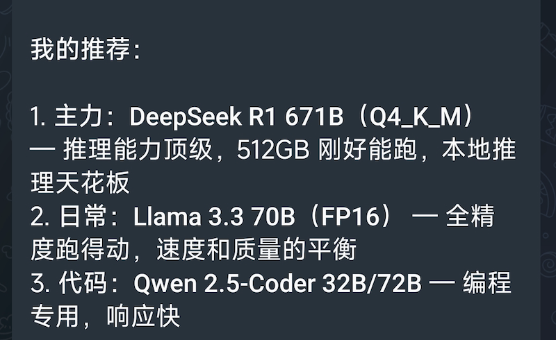
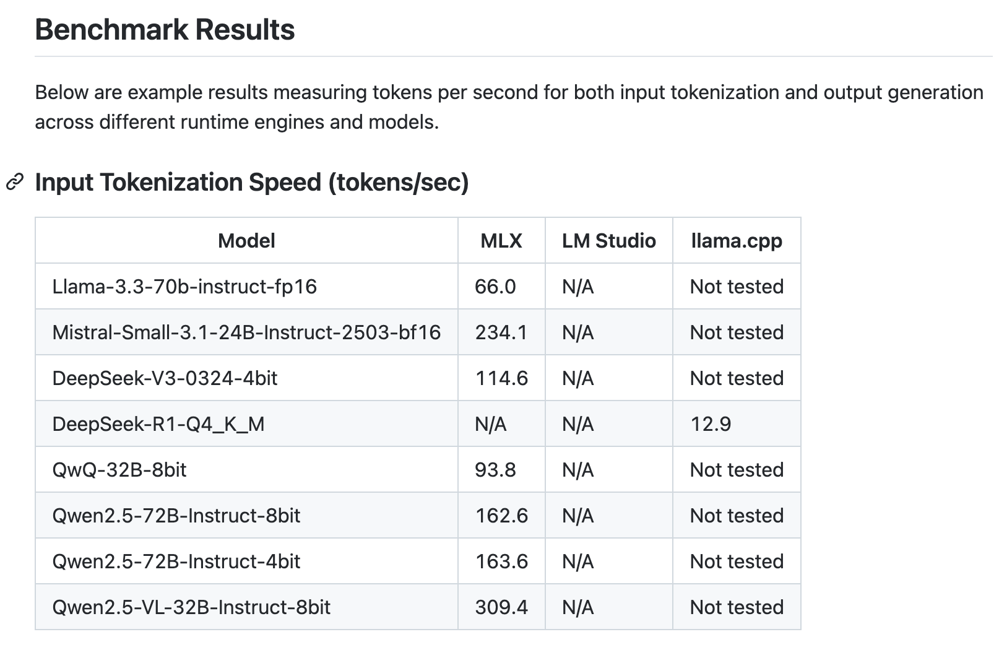
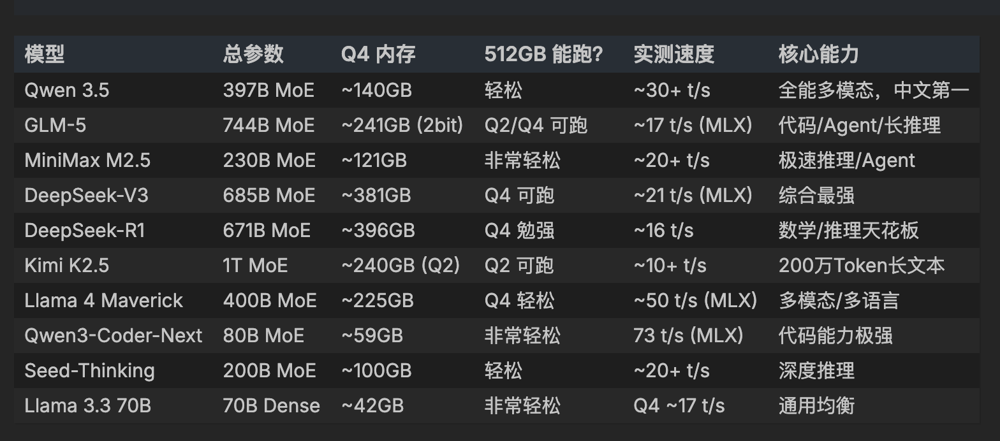

> AI 擅长搜索和总结，但它对信息的时效性判断和搜索覆盖面经常翻车。

前段时间刷到一条苹果下架 512GB 内存 M3 Ultra 的 Mac Studio 配置选项，出于好奇顺手把问题丢给了获麟：

> Mac Studio M3 Ultra 512GB，最适合部署哪个大模型？



我瞬间惊觉：**Qwen 2.5？Llama 3.3？今夕是何年？**

## 是模型太弱了吗？

获麟现在用的是阿里的 Coding Plan，配置的是 Glm-5。

我又去 ChatGPT、Claude 等上面做了同样的提问，回答都大同小异。甚至很多模型给的答案跟获麟的惊人一致。

## 到底哪里出了问题？

我去翻了下 OpenClaw 的后台日志，发现获麟就是一通搜索，总结后给了我结论。

我甚至找到了一篇文章几乎能够涵盖这个答案，文章正是对 512GB 的 Mac Studio 做的大模型测试，并且其使用的模型正好是获麟答案里给到的：



OpenClaw 在处理我这个问题的过程基本就是：

1. 分解问题成不同的关键词
2. 搜索这些关键词
3. 获取前几条结果的页面内容
4. 汇总得出答案

所以翻车的原因很简单：

- **信息源方面**：差不多 1 年以前有人拿 512GB 的 Mac Studio 做过测试，发布过文章，后续没有人持续更新测评文章，但大模型一直在更新
- **Agent 方面**：获麟拿到问题直接开始搜答案，结果就只能拿到一些过时的信息

于是，过时的信息只能得到过时的答案。

针对我的问题，互联网上的公开信息理论上是能够组织出更好的答案的，关键问题在于 Agent 解决问题的方法。

这跟 RAG 经常不好用很像——虽然可能在知识库里隐藏着标准答案，但因为检索的问题，AI 拿到的信息不对，就无法得出合适的答案。

## 你自己反省一下

> 能不能跑 MiniMax 2.5 满血版？

因为在我的印象中，开源模型中的 MiniMax 算是参数量比较小的，就算不能跑满血版，也能跑量化版本。于是我继续追问获麟，果然他给的答案是能够跑的🤣

接着我让他分析下，为什么第一次给的答案里没有 MiniMax 2.5。他给出了三大理由：

**问题一：搜索路径单一**

所有搜索词都围绕「M3 Ultra 512GB + LLM」这个硬件视角展开，所以只能找到"已经有人在 M3 Ultra 上测过的模型"。

**问题二：缺少全景视角**

没有做过一轮"2026 年最强开源模型全景扫描"。所以不知道当前这个时间点上到底有哪些值得关注的模型，自然无法判断自己遗漏了什么。

**问题三：搜索词设计的局限**

第一轮的搜索词全部是泛化的：`best LLM`、`what models can fit`、`benchmark performance`。没有出现任何具体的模型名称。

换句话说，我的搜索路径是「硬件 → 找模型」，而缺少了「模型全景 → 筛选适配硬件」这条反向路径。如果加上后者，MiniMax-M2.5 这类"参数不大但能力很强"的模型就不会被遗漏。

## 那就按你说的做！

果然，获麟按照他自己总结的这条"反向路径"操作后就可以获得比较好的结果了：



而且获麟还给出了步骤：

```
Step 1: 反向搜索 -- "该领域当前全景是什么"
         ↓
Step 2: 建立全量清单（不带任何过滤条件）
         ↓
Step 3: 正向搜索 -- "我的具体条件 + 关键词"
         ↓
Step 4: 合并两条路径的结果，去重
         ↓
Step 5: 逐一深挖每个候选项的细节
         ↓
Step 6: 标注所有来源的日期，剔除过时信息
         ↓
Step 7: 按场景分类输出最终推荐
```

核心逻辑是**先知道"世界上有什么"，再判断"哪些适合我"**，而不是上来就按关键词搜索，反而只能拿到过时的信息。