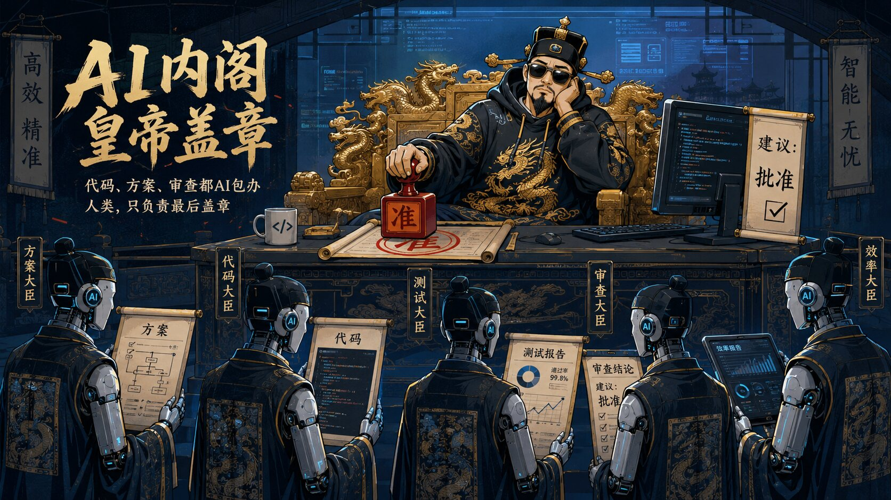

去年年底开始，我的工作几乎全押在 AI 编程上，几乎没手写过几行代码。

公司大力支持，Claude Code、Codex、各种 Agent 全开，一个月光编程工具的 token 费用就要花掉接近 **2000 美金**。产出确实爆炸——一个人干以前三四个人的活，开发速度翻了好几倍。

我一度觉得找到了正确的范式，还想着在团队里做一套 AI 编程的治理流程：让 AI 负责脑暴、设计方案、开发、测试，中间过程全都自动接入公司的基础设施，最后由人来做审查、审批和最后的上线工作。

画出来很漂亮——AI 干活，人把关。理论上完美。

可现实是根本做不下来。

一天下来，AI 产出了几十个方案、上万行代码、十几个测试报告。你让一个人审？审不完。你让几个人审？那 AI 提速的意义在哪？

最后发现，所谓的“人审查审批”就是走个形式。看了一部分之后就自动进入了“应该没问题”的心理状态——**审查变成了签字。**

更离谱的是为了让 AI 别烦我，我开始偷懒。

嫌 GPT 回复太啰嗦，预设 prompt 加上：“简要回复，3 个要点以内”。

嫌 Claude Code 啥都要授权，直接把他跑在 bypass permissions 模式上。

嫌 Agent 产出的代码太多，我只会点开 git 树查看哪些文件有变化。

我本来以为我是一个很会“驯化”AI 的人——规则清晰、边界明确、效率拉满。

但事实上——**不是我在驯化 AI，是 AI 在驯化我。**

---

## 想当年，我可是逐字看 AI 思考过程的人

DeepSeek R1 刚出来那会儿，我对着它的思考过程能看半小时。

每一段推理、每一次回溯、每一条犹豫——比答案本身有意思多了。

有段时间觉得自己的思维方式都被它影响了，遇到复杂问题会不自觉地想“如果是 DeepSeek，它会先想什么”。

那时候 AI 像一个比你聪明的前辈，你愿意听它把话说完。

现在？尤其是 GPT 能给你回复好几屏，我的眼睛直接滑到底部找结论，中间一个字都没看。

我逐渐被训练成了只接受结论的人。

---

## 最讽刺的是，我正在逐渐被架空

最近看到同事搞了个 Codex 监工，觉得不错。

于是很快复刻了一个——派一个 Agent 当监工，盯着其他 Agent 干活，帮我做审查和验收，最后只给我结论和需要我决策的关键点。

听起来解决了问题？不，**这是被架空的最后一环。**

这就很像古代的皇帝。

一开始自己批奏折，后来奏折太多批不过来，设了个内阁帮审。

内阁审完只给他看摘要，他只管批“准”。

再后来内阁连摘要都替他拟好了，他只管盖章。

到最后，他觉得自己还挺忙的——每天要盖那么多章呢。

**我现在就在“内阁帮审”这个阶段。**

代码是 AI 写的，方案是 AI 出的，审查是 AI 做的，我负责在最后盖个章。

有时候其实连盖章都不想盖，AI 把最终结果交付给我就行。

此时，我会觉得效率很高、产出很猛、一切尽在掌控。

但实际上，我已经看不懂自己项目里在跑什么了。

更悲剧的是，我可能不会觉得这是失控。

我会觉得这是进化。
