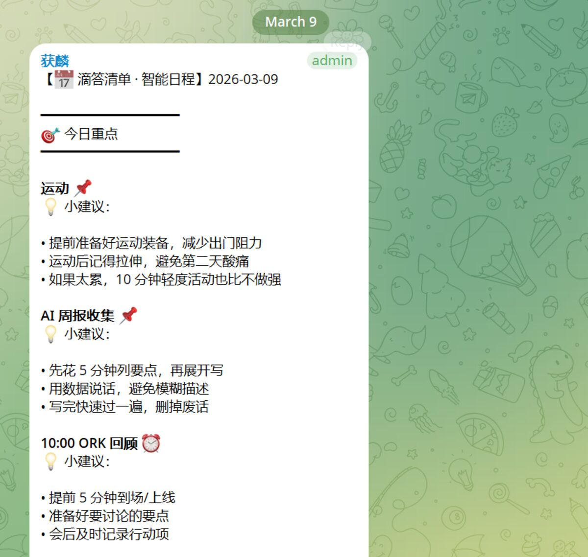
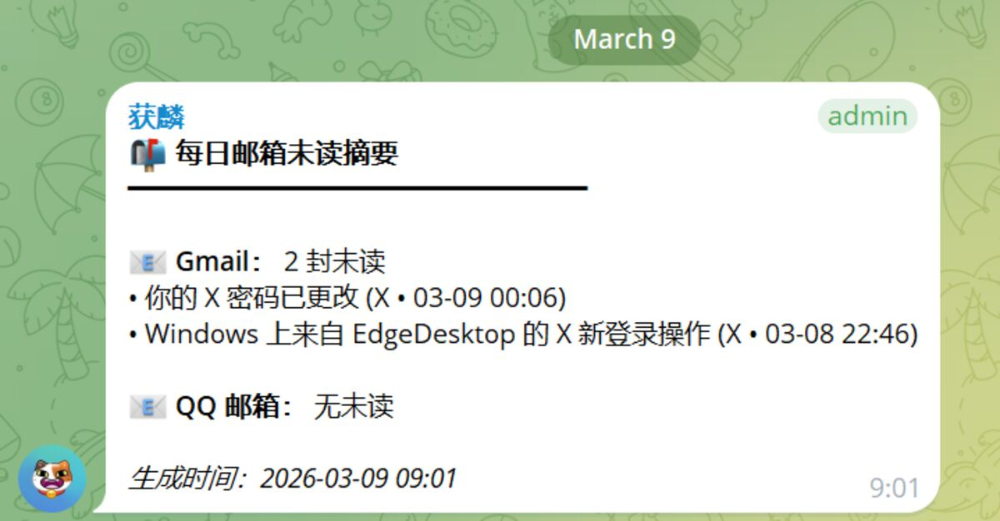
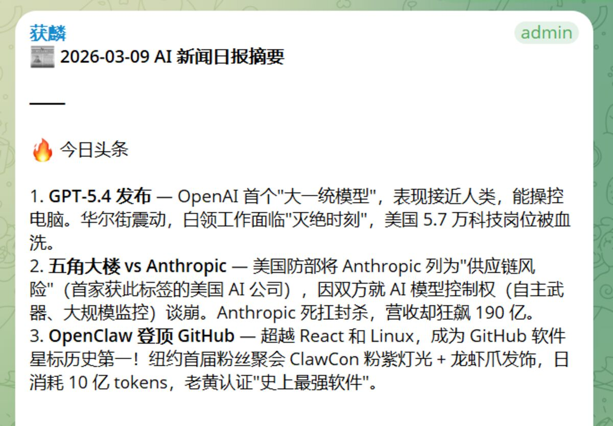
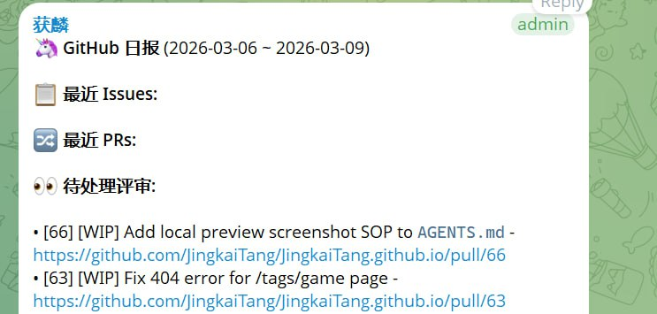

# 我也来养龙虾啦

感觉又错过了一个风口。

我早在 openclaw 还叫 clawdbot 的时候就开始用了，也在周会上给同事们分享过。

小龙虾一开始火的时候经历了两次改名：一开始叫 clawdbot，没火两天，就因为 anthropic 公司的压力改名叫 moltbot 了；然后又没过两天，又改名叫了 openclaw，说是因为 moltbot 商标啊域名被抢注的问题。

改名后，命令行工具和 npm 包的名字也改了，虽然做了些兼容，但经常遇到问题。那几天真的是一更新就炸，一开始我用了些起别名或者链接的办法暂时修复了下，后来就一口气给卸了重装。

## 初次见面

1 月底的时候，当时我刚休完陪产假，上班路上正好刷到了小龙虾的新闻。午休的时候就忍不住在笔记本上部署了起来，一下子就被吸引了。

我立刻就决定部署到家里，当天下班后我掏出我上学时的笔记本电脑，直接格式化安装了 Linux（我安装了 CachyOS，一个基于 ArchLinux 的发行版），并以此作为龙虾窝，开始了我的养虾之旅。

### IM 选择

一开始我用飞书为主，telegram 作为备份。结果没两天就发生了上面改名的问题，直接把飞书插件整得不能用了。后面就干脆直接把 telegram 扶正🤣

### 模型选择

一开始在公司电脑上试过 GitHub Copilot，当时还有经典的 GPT-4o 模型。

刚开始在自己家部署的时候，也试过 DeepSeek 和 MiniMax。

那几天正巧碰上之前充值 ChatGPT 的野卡给我退钱了，我哭死。说是余额能退，但是充值的野卡会员折现的钱只能用来继续充值 ChatGPT 之类的。我二话不说当然选择充值啦。所以后面一整段时间，我都用的 Codex 来跑龙虾。

上周我的 ChatGPT Plus 也过期了，不过我发现还是有免费的额度可以用。

这个月初的时候，我又充值了阿里的 Coding Plan，体验了下，速度蛮快的。

### 我的小龙虾

我的小龙虾叫做获麟，是一只布偶猫，形象是用我同学之前的猫创建的。

跟其他人分享的不太一样，我就只养了一只龙虾，不同主题的事情用 telegram 群组的 topic 功能实现。

## 我的用途分享

### 远程 Vibe Coding

第一个就是各种 vibe coding 项目，可以用获麟远程完成闭环。

我在聊天窗口里提需求，它来开发、测试、提交 PR、处理评审以及合并部署。

比较典型的是我的个人主页 https://jingkaitang.github.io/

以前都很难有精力去维护，现在大部分工作可以交个获麟来处理。

现在我的主页主要由获麟每天发发牢骚🤣（躺平充电表示我的主页今天没有迭代需求），主要是我比较懒，一两个月更新一篇文章😅

### 写博客、发公众号

没错，通过小龙虾写博客发公众号，这也是我在我的个人主页项目上跑通的流程。

我在手机上提出主题，提出一些离散的想法，然后配些图片，再让获麟帮我整理成文章，最后审核没问题就发到自己的主页和公众号。

### 今日和最近日程

我的日程表维护在滴答清单上。因为是国内版，所以当时小龙虾上没有一个现成的 skill 或者插件能用。不过有 AI 了，就没什么好怕的，获麟帮我对标当时的 TickTick（滴答清单的国际版）版的 skill 手搓了一个滴答清单的 skill。

### 邮件处理

我连接了 QQ 邮箱和 Gmail，每天获麟都帮我检查未读邮件，汇报给我。

邮箱用得不太频繁，但经常错过一些重要邮件，又不想一直关注推送，所以就让获麟每天检查一次给我看。

### AI 新闻

不过这个并不完全由小龙虾实现的，我 vibe coding 了一套抓取 RSS 新闻的脚本出来，然后 systemd 的定时任务每天早上 9 点自动执行，完成后更新到我的 Obsidian 笔记中去。这样我每天上班就可以看到最新的新闻资讯了。

获麟只是在执行完成后把最后的报告摘要给我。

主要就是为了在摘要资讯文章的时候用点免费的模型，省点 token。

目前主要的问题就是，老搞不清楚日期的问题，经常把之前的文章当成是今天的。

### GitHub 动态

我还让获麟帮我盯着 GitHub 上的动态。主要用来跟踪一些感兴趣的开源项目的 issue 和 PR，看看有没有什么新功能或者有趣的讨论。

这个功能还在打磨中，目前主要是定期拉取一些项目的动态，然后汇总给我看。省得我自己一个个去刷 GitHub，有时候错过了重要更新都不知道。

### X 动态

另外我也接了 X（前 Twitter）的动态推送。主要是关注一些 AI 领域的大佬，看看他们最近在讨论什么、发了什么新东西。

AI 圈子的信息更新太快了，有时候一个新技术、新模型出来，第一时间就是从这些大佬的推文里看到的。让获麟帮我盯着的的好处是：不用自己一直刷 X，但也不会错过重要信息。

（平时连朋友圈都不经常刷，26 年立个 flag：朋友圈刷够 100 次）

---

*写于上海*